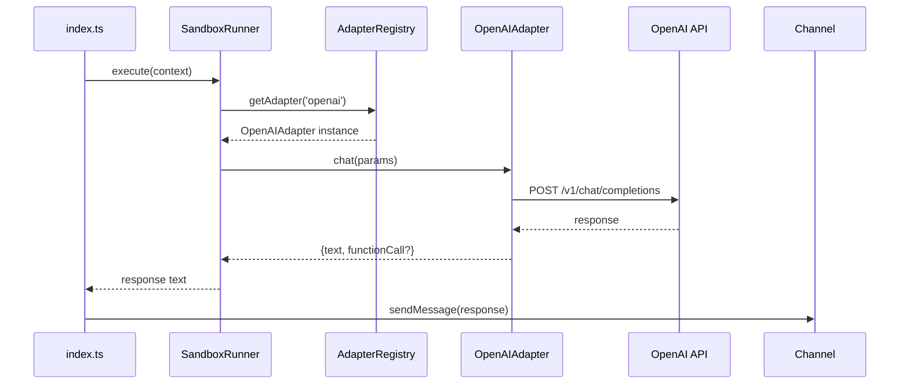
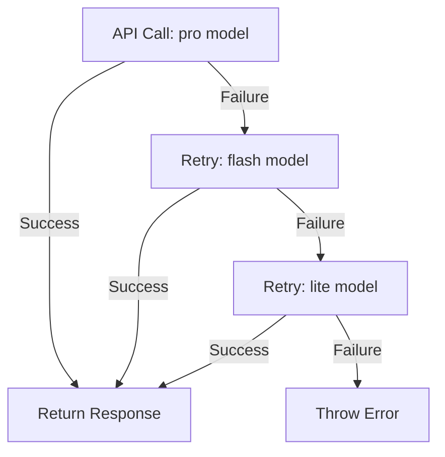

# Design Document: Phase 1 Agent 执行链路打通

## Overview

本设计文档定义 Proposal-020 Phase 1 的技术实现方案：Agent 执行链路打通。目标是建立从消息路由到 Agent 执行再到 LLM 调用的完整链路，替换 `src/index.ts` 中的 TODO 存根，实现真正的 Agent 执行能力。

Phase 1 在 Phase 0（关键 Bug 修复）完成后执行，是第一个功能性增强阶段。核心任务包括：

1. 定义 Agent Runner 抽象接口
2. 实现基于 Sandbox 的 Runner
3. 类型化 LLM Adapter 接口
4. 实现 Adapter Registry
5. 迁移 OpenAI Adapter 至 TypeScript
6. 集成至主流程
7. 统一配置系统

## Architecture

### 系统分层

```
┌──────────────────────────────────────────────────────┐
│                  入口层 (index.ts)                    │
│         processGroup() / executeScheduledTask()       │
└──────────────────────────────────────────────────────┘
                          ↓
┌──────────────────────────────────────────────────────┐
│             Agent 执行层 (src/agent/)  【新增】        │
│   AgentRunner 接口 + SandboxRunner 实现               │
│   职责：构建执行上下文，调用 LLM，返回结果             │
└──────────────────────────────────────────────────────┘
                          ↓
┌──────────────────────────────────────────────────────┐
│           模型适配层 (src/adapters/)  【类型化】       │
│   LLMAdapter 接口 + AdapterRegistry                   │
│   + OpenAI/Claude/Gemini 实现                         │
│   职责：统一 LLM 调用接口，隐藏各 API 差异             │
└──────────────────────────────────────────────────────┘
                          ↓
┌──────────────────────────────────────────────────────┐
│            沙盒层 (src/sandbox/)  【已存在】           │
│   SandboxManager + ProcessExecutor                    │
│   职责：进程级隔离，多级降级                           │
└──────────────────────────────────────────────────────┘
```

### 执行流程



### 降级策略



## Components and Interfaces

### 1. Agent Runner 接口

**文件**: `src/agent/runner.ts`

```typescript
import { Channel } from '../types.js';

/**
 * Agent 执行上下文
 */
export interface ExecutionContext {
  /** Group 工作目录 */
  groupFolder: string;
  /** 发送给 LLM 的 prompt */
  prompt: string;
  /** 消息通道（用于发送响应） */
  channel: Channel;
  /** 消息历史（可选） */
  history?: Array<{role: string; content: string}>;
}

/**
 * Agent Runner 抽象接口
 * 定义统一的 Agent 执行契约，支持多种执行策略
 */
export interface AgentRunner {
  /**
   * 执行 Agent 任务
   * @param context 执行上下文
   * @returns LLM 响应文本
   */
  execute(context: ExecutionContext): Promise<string>;

  /**
   * 清理资源
   */
  close(): Promise<void>;
}
```

**设计决策**:
- `ExecutionContext` 包含执行所需的最小信息集
- `AgentRunner` 接口足够抽象，未来可支持容器、本地进程等多种实现
- `close()` 方法确保资源正确释放

### 2. Sandbox Runner 实现

**文件**: `src/agent/sandbox-runner.ts`

```typescript
import { AgentRunner, ExecutionContext } from './runner.js';
import { getAdapter } from '../adapters/registry.js';
import { log } from '../logger.js';

/**
 * 基于 Sandbox 的 Agent Runner 实现
 * 通过 AdapterRegistry 获取 LLM Adapter 并执行
 */
export class SandboxRunner implements AgentRunner {
  private adapterName: string;

  constructor(adapterName: string = 'openai') {
    this.adapterName = adapterName;
  }

  async execute(context: ExecutionContext): Promise<string> {
    log(`[SandboxRunner] Executing with adapter: ${this.adapterName}`, 'DEBUG');

    // 获取 LLM Adapter
    const adapter = getAdapter(this.adapterName);
    if (!adapter) {
      const error = `No LLM adapter available: ${this.adapterName}`;
      log(`[SandboxRunner] ${error}`, 'ERROR');
      return `Error: ${error}`;
    }

    try {
      // 调用 LLM
      const response = await adapter.chat({
        systemInstruction: 'You are a helpful assistant.',
        history: context.history || [],
        message: context.prompt,
        preferredLevel: 'pro'
      });

      log(`[SandboxRunner] LLM response received`, 'DEBUG');
      return response.text;
    } catch (error) {
      const errorMsg = error instanceof Error ? error.message : String(error);
      log(`[SandboxRunner] Execution failed: ${errorMsg}`, 'ERROR');
      return `Error: ${errorMsg}`;
    }
  }

  async close(): Promise<void> {
    log(`[SandboxRunner] Closing`, 'DEBUG');
    // 当前实现无需清理资源
    // 未来如果使用持久化连接，在此处清理
  }
}
```

**设计决策**:
- 构造函数接受 `adapterName` 参数，默认使用 `openai`
- 错误处理：adapter 不可用或调用失败时返回错误消息（不抛出异常）
- 日志记录：关键步骤均记录日志，便于调试

### 3. LLM Adapter 接口类型化

**文件**: `src/adapters/base.ts`

```typescript
/**
 * LLM 聊天参数
 */
export interface ChatParams {
  /** 系统指令 */
  systemInstruction: string;
  /** 对话历史 */
  history: Array<{role: string; parts: Array<{text: string}>}>;
  /** 用户消息 */
  message: string | Array<{text: string}>;
  /** 工具定义（可选） */
  tools?: Array<{
    name: string;
    description: string;
    parameters: Record<string, unknown>;
  }>;
  /** 优先模型级别 */
  preferredLevel?: 'pro' | 'flash' | 'lite';
}

/**
 * LLM 聊天响应
 */
export interface ChatResponse {
  /** 响应文本 */
  text: string;
  /** 函数调用（可选） */
  functionCall?: {
    name: string;
    args: Record<string, unknown>;
  };
}

/**
 * LLM Adapter 抽象接口
 * 统一不同 LLM 提供商的调用方式
 */
export abstract class LLMAdapter {
  /**
   * 对话接口
   * @param params 聊天参数
   * @returns 聊天响应
   */
  abstract chat(params: ChatParams): Promise<ChatResponse>;
}
```

**设计决策**:
- `ChatParams` 包含所有 LLM 调用所需参数
- `history` 使用 Gemini 风格的 `parts` 数组，便于多模态扩展
- `preferredLevel` 支持三级模型选择
- `ChatResponse` 支持文本和函数调用两种响应类型

### 4. Adapter Registry 实现

**文件**: `src/adapters/registry.ts`

```typescript
import { LLMAdapter } from './base.js';

/**
 * Adapter 工厂函数类型
 */
export type AdapterFactory = () => LLMAdapter;

/**
 * Adapter 注册表
 */
const registry = new Map<string, AdapterFactory>();

/**
 * 注册 Adapter 工厂
 * @param name Adapter 名称
 * @param factory Adapter 工厂函数
 */
export function registerAdapter(name: string, factory: AdapterFactory): void {
  registry.set(name, factory);
}

/**
 * 获取 Adapter 实例
 * @param name Adapter 名称
 * @returns Adapter 实例，如果不存在则返回 null
 */
export function getAdapter(name: string): LLMAdapter | null {
  const factory = registry.get(name);
  if (!factory) {
    return null;
  }
  return factory();
}

/**
 * 获取所有已注册的 Adapter 名称
 * @returns Adapter 名称数组
 */
export function getRegisteredAdapterNames(): string[] {
  return [...registry.keys()];
}

/**
 * 清空注册表（仅用于测试）
 * @internal
 */
export function clearRegistry(): void {
  registry.clear();
}
```

**设计决策**:
- 与 `ChannelRegistry` 保持同构设计
- 使用工厂模式，每次调用 `getAdapter()` 返回新实例
- `clearRegistry()` 仅用于测试，标记为 `@internal`

### 5. OpenAI Adapter 迁移

**文件**: `src/adapters/openai.ts`

```typescript
import { LLMAdapter, ChatParams, ChatResponse } from './base.js';
import { registerAdapter } from './registry.js';
import { log } from '../logger.js';
import OpenAI from 'openai';

/**
 * OpenAI Adapter
 * 支持 GPT-4 Turbo、GPT-4、GPT-3.5 Turbo
 * 降级链：pro → flash → lite
 */
export class OpenAIAdapter extends LLMAdapter {
  private client: OpenAI;
  private models: Record<string, string>;

  constructor(config: {apiKey?: string; baseURL?: string} = {}) {
    super();
    const apiKey = config.apiKey || process.env.OPENAI_API_KEY;
    if (!apiKey) {
      throw new Error('[OpenAI] API Key not configured');
    }

    this.client = new OpenAI({
      apiKey,
      baseURL: config.baseURL || 'https://api.openai.com/v1'
    });

    this.models = {
      pro: 'gpt-4-turbo-preview',
      flash: 'gpt-4',
      lite: 'gpt-3.5-turbo'
    };
  }

  async chat(params: ChatParams): Promise<ChatResponse> {
    const level = params.preferredLevel || 'pro';
    const model = this.models[level];

    try {
      const messages = this._convertHistory(
        params.systemInstruction,
        params.history,
        params.message
      );

      const openaiTools = this._convertTools(params.tools || []);

      const requestParams: OpenAI.Chat.ChatCompletionCreateParams = {
        model,
        messages,
        temperature: 0.7,
        max_tokens: 4096
      };

      if (openaiTools.length > 0) {
        requestParams.tools = openaiTools;
        requestParams.tool_choice = 'auto';
      }

      log(`[OpenAI] Calling ${model}`, 'DEBUG');
      const response = await this.client.chat.completions.create(requestParams);

      const choice = response.choices[0];
      const message = choice.message;

      // 检查函数调用
      if (message.tool_calls && message.tool_calls.length > 0) {
        const toolCall = message.tool_calls[0];
        return {
          text: message.content || '',
          functionCall: {
            name: toolCall.function.name,
            args: JSON.parse(toolCall.function.arguments)
          }
        };
      }

      return {
        text: message.content || ''
      };
    } catch (error) {
      log(`[OpenAI] Error with ${model}: ${error}`, 'ERROR');

      // 降级处理
      if (level === 'pro') {
        log('[OpenAI] Downgrading to flash', 'WARN');
        return this.chat({...params, preferredLevel: 'flash'});
      } else if (level === 'flash') {
        log('[OpenAI] Downgrading to lite', 'WARN');
        return this.chat({...params, preferredLevel: 'lite'});
      }

      throw error;
    }
  }

  private _convertHistory(
    systemInstruction: string,
    history: Array<{role: string; parts: Array<{text: string}>}>,
    message: string | Array<{text: string}>
  ): Array<OpenAI.Chat.ChatCompletionMessageParam> {
    const messages: Array<OpenAI.Chat.ChatCompletionMessageParam> = [];

    // 系统提示词
    if (systemInstruction) {
      messages.push({
        role: 'system',
        content: systemInstruction
      });
    }

    // 历史记录
    for (const item of history) {
      if (item.role === 'user') {
        messages.push({
          role: 'user',
          content: this._extractText(item.parts)
        });
      } else if (item.role === 'model') {
        messages.push({
          role: 'assistant',
          content: this._extractText(item.parts)
        });
      }
    }

    // 当前消息
    if (typeof message === 'string') {
      messages.push({
        role: 'user',
        content: message
      });
    } else if (Array.isArray(message)) {
      messages.push({
        role: 'user',
        content: this._extractText(message)
      });
    }

    return messages;
  }

  private _extractText(parts: Array<{text: string}>): string {
    return parts.map(p => p.text).join('\n');
  }

  private _convertTools(
    tools: Array<{name: string; description: string; parameters: Record<string, unknown>}>
  ): Array<OpenAI.Chat.ChatCompletionTool> {
    return tools.map(tool => ({
      type: 'function' as const,
      function: {
        name: tool.name,
        description: tool.description,
        parameters: tool.parameters
      }
    }));
  }
}

// 自动注册至 Adapter Registry
registerAdapter('openai', () => new OpenAIAdapter());
```

**设计决策**:
- 保持与 `openai.js` 的 API 兼容性
- 类型安全：使用 OpenAI SDK 的类型定义
- 降级策略：pro → flash → lite
- 模块加载时自动注册至 `AdapterRegistry`

## Data Models

### ExecutionContext

```typescript
interface ExecutionContext {
  groupFolder: string;      // Group 工作目录路径
  prompt: string;            // 发送给 LLM 的 prompt
  channel: Channel;          // 消息通道实例
  history?: Array<{          // 可选的消息历史
    role: string;
    content: string;
  }>;
}
```

### ChatParams

```typescript
interface ChatParams {
  systemInstruction: string;                    // 系统指令
  history: Array<{                              // 对话历史
    role: string;
    parts: Array<{text: string}>;
  }>;
  message: string | Array<{text: string}>;      // 用户消息
  tools?: Array<{                               // 工具定义
    name: string;
    description: string;
    parameters: Record<string, unknown>;
  }>;
  preferredLevel?: 'pro' | 'flash' | 'lite';    // 模型级别
}
```

### ChatResponse

```typescript
interface ChatResponse {
  text: string;                                 // 响应文本
  functionCall?: {                              // 可选的函数调用
    name: string;
    args: Record<string, unknown>;
  };
}
```

## Correctness Properties

*A property is a characteristic or behavior that should hold true across all valid executions of a system-essentially, a formal statement about what the system should do. Properties serve as the bridge between human-readable specifications and machine-verifiable correctness guarantees.*

### Property Reflection

经过对 prework 分析的审查，识别出以下可测试属性：

**可测试的属性和示例**:
- 2.4: SandboxRunner 返回值与 adapter.chat() 返回值的关系（属性）
- 9.1: 触发词识别（属性）
- 9.3: LLM 响应传递（属性）
- 其他大部分是具体示例测试（example）或错误场景测试

**冗余分析**:
- 2.2 和 2.3 是实现细节，可以合并为一个集成测试
- 6.1、6.2、6.3 是同一流程的不同步骤，可以合并为一个端到端测试
- 9.2 和 9.4 是端到端流程的中间步骤，已被 9.1 和 9.3 覆盖

### Property 1: SandboxRunner 响应传递

*For any* valid `ChatResponse` returned by `adapter.chat()`, the `SandboxRunner.execute()` method should return the `text` field of that response.

**Validates: Requirements 2.4**

### Property 2: 触发词识别的一致性

*For any* message containing a registered trigger word, the system should consistently identify that trigger word regardless of the message's surrounding content.

**Validates: Requirements 9.1**

### Property 3: LLM 响应端到端传递

*For any* LLM-generated response text, when the Agent Runner successfully executes, the system should deliver that exact text through the Channel without modification.

**Validates: Requirements 9.3**

## Error Handling

### 错误分类

| 错误类型 | 处理策略 | 用户反馈 |
|---------|---------|---------|
| Adapter 不可用 | 返回错误消息 | "No LLM adapter available: {name}" |
| API 调用超时 | 返回错误消息 | "LLM request timeout" |
| API 4xx 错误 | 记录日志，返回友好消息 | "Invalid request to LLM service" |
| API 5xx 错误 | 降级至下一级模型 | 透明降级，无需通知用户 |
| 所有降级失败 | 返回错误消息 | "All LLM models unavailable" |

### 降级策略

```typescript
// OpenAI Adapter 降级逻辑
try {
  // 尝试 pro 模型
  return await callAPI('gpt-4-turbo-preview');
} catch (error) {
  if (is5xxError(error)) {
    try {
      // 降级至 flash 模型
      return await callAPI('gpt-4');
    } catch (error) {
      if (is5xxError(error)) {
        // 降级至 lite 模型
        return await callAPI('gpt-3.5-turbo');
      }
      throw error;
    }
  }
  throw error;
}
```

### 日志记录

所有错误均记录至日志系统：

```typescript
log(`[OpenAI] Error with ${model}: ${error.message}`, 'ERROR');
log('[OpenAI] Downgrading to flash', 'WARN');
```

## Testing Strategy

### 测试方法

本项目采用双重测试策略：

1. **单元测试（Unit Tests）**: 验证具体示例、边界条件和错误场景
2. **属性测试（Property-Based Tests）**: 验证通用属性在所有输入下的正确性

两种测试方法互补：单元测试捕获具体 bug，属性测试验证通用正确性。

### 单元测试覆盖

#### 1. Agent Runner 接口测试

**文件**: `tests/agent-runner.test.ts`

测试内容：
- SandboxRunner 构造函数
- execute() 方法调用 AdapterRegistry
- execute() 方法调用 adapter.chat()
- execute() 方法处理 adapter 不可用的情况
- close() 方法正常执行

Mock 策略：
- Mock `AdapterRegistry.getAdapter()`
- Mock `LLMAdapter.chat()`

#### 2. Adapter Registry 测试

**文件**: `tests/adapter-registry.test.ts`

测试内容：
- registerAdapter() 注册成功
- getAdapter() 返回正确实例
- getAdapter() 对不存在的 adapter 返回 null
- getRegisteredAdapterNames() 返回所有名称
- 工厂函数每次返回新实例

#### 3. OpenAI Adapter 测试

**文件**: `tests/openai-adapter.test.ts`

测试内容：
- 构造函数验证 API Key
- chat() 方法调用 OpenAI API
- 支持 pro、flash、lite 三个级别
- 降级策略：pro → flash → lite
- 函数调用响应解析
- 历史记录格式转换
- 工具定义格式转换

Mock 策略：
- Mock OpenAI SDK 的 `chat.completions.create()`

集成测试（需要 `OPENAI_API_KEY` 环境变量）：
- 真实 API 调用测试
- 降级策略验证

#### 4. 主流程集成测试

**文件**: `tests/phase-1-integration.test.ts`

测试内容：
- processGroup() 创建 SandboxRunner
- processGroup() 调用 runner.execute()
- processGroup() 通过 Channel 发送响应
- processGroup() 处理 execute() 异常
- executeScheduledTask() 集成测试

Mock 策略：
- Mock Channel.sendMessage()
- Mock SandboxRunner.execute()

### 属性测试配置

使用 `fast-check` 库进行属性测试，每个测试运行 100 次迭代。

#### Property 1 测试

```typescript
// tests/properties/sandbox-runner.property.test.ts
import fc from 'fast-check';

/**
 * Feature: phase-1-agent-execution-chain, Property 1: SandboxRunner 响应传递
 * For any valid ChatResponse returned by adapter.chat(), 
 * the SandboxRunner.execute() method should return the text field of that response.
 */
test('Property 1: SandboxRunner response passthrough', async () => {
  await fc.assert(
    fc.asyncProperty(
      fc.string(), // 任意响应文本
      async (responseText) => {
        // Mock adapter
        const mockAdapter = {
          chat: jest.fn().mockResolvedValue({ text: responseText })
        };
        
        // Mock registry
        jest.spyOn(registry, 'getAdapter').mockReturnValue(mockAdapter);
        
        const runner = new SandboxRunner('test');
        const context = createMockContext();
        
        const result = await runner.execute(context);
        
        expect(result).toBe(responseText);
      }
    ),
    { numRuns: 100 }
  );
});
```

#### Property 2 测试

```typescript
// tests/properties/trigger-detection.property.test.ts
import fc from 'fast-check';

/**
 * Feature: phase-1-agent-execution-chain, Property 2: 触发词识别的一致性
 * For any message containing a registered trigger word, 
 * the system should consistently identify that trigger word 
 * regardless of the message's surrounding content.
 */
test('Property 2: Trigger word detection consistency', () => {
  fc.assert(
    fc.property(
      fc.constantFrom('@agent', '@bot', '@assistant'), // 触发词
      fc.string(), // 前缀
      fc.string(), // 后缀
      (trigger, prefix, suffix) => {
        const message = `${prefix}${trigger}${suffix}`;
        const detected = detectTriggerWord(message);
        
        expect(detected).toBe(trigger);
      }
    ),
    { numRuns: 100 }
  );
});
```

#### Property 3 测试

```typescript
// tests/properties/end-to-end.property.test.ts
import fc from 'fast-check';

/**
 * Feature: phase-1-agent-execution-chain, Property 3: LLM 响应端到端传递
 * For any LLM-generated response text, when the Agent Runner successfully executes, 
 * the system should deliver that exact text through the Channel without modification.
 */
test('Property 3: End-to-end response delivery', async () => {
  await fc.assert(
    fc.asyncProperty(
      fc.string(), // 任意 LLM 响应
      async (llmResponse) => {
        // Mock 整个链路
        const mockChannel = { sendMessage: jest.fn() };
        const mockAdapter = {
          chat: jest.fn().mockResolvedValue({ text: llmResponse })
        };
        
        jest.spyOn(registry, 'getAdapter').mockReturnValue(mockAdapter);
        
        await processGroup(mockContext);
        
        expect(mockChannel.sendMessage).toHaveBeenCalledWith(
          expect.objectContaining({ text: llmResponse })
        );
      }
    ),
    { numRuns: 100 }
  );
});
```

### 测试覆盖率目标

- 整体覆盖率：≥ 70%
- 核心模块（agent/, adapters/）：≥ 80%
- 关键路径（processGroup, executeScheduledTask）：100%

### 验收标准

Phase 1 完成后，必须满足：

1. `npm test` 全部通过
2. `npm run typecheck` 零错误
3. 端到端测试：发送触发词 → 收到 LLM 响应
4. 所有属性测试通过（100 次迭代）
