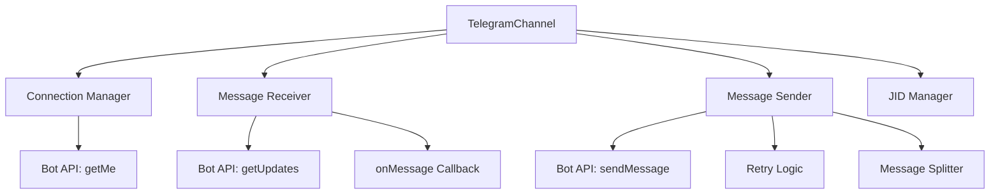
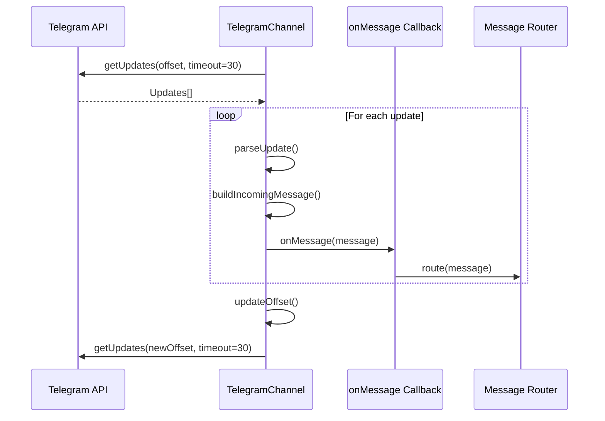
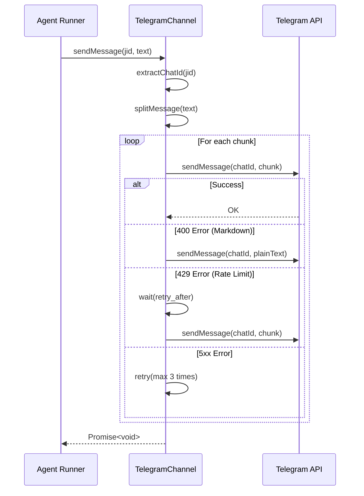

# Design Document: Phase 2 Telegram Channel

## Overview

本设计文档定义 Proposal-020 Phase 2 的技术实现方案：Telegram Channel 实现。目标是通过 Telegram Bot API 实现 Channel 接口，使系统能够通过 Telegram 收发消息，建立第一个生产可用的通信通道。

Phase 2 在 Phase 1（Agent 执行链路打通）完成后执行，是通道层的首个具体实现。核心任务包括：

1. 实现 Telegram Channel 类
2. 集成 Telegram Bot API
3. 实现 Long Polling 消息接收
4. 实现消息发送与格式化
5. 实现错误处理与重试机制
6. 注册至 Channel Registry
7. 编写单元测试和集成测试

Phase 2 完成后，CloseClaw 将能够通过 Telegram Bot 与用户交互，验证 Channel 接口的实用性和完整性。

## Architecture

### 系统分层

```
┌──────────────────────────────────────────────────────┐
│                  入口层 (index.ts)                    │
│         processGroup() / executeScheduledTask()       │
└──────────────────────────────────────────────────────┘
                          ↓
┌──────────────────────────────────────────────────────┐
│             通道层 (src/channels/)  【扩展】           │
│   Channel 接口 + TelegramChannel 实现                 │
│   职责：消息收发，协议适配                             │
└──────────────────────────────────────────────────────┘
                          ↓
┌──────────────────────────────────────────────────────┐
│           Telegram Bot API                            │
│   getMe, getUpdates, sendMessage                      │
└──────────────────────────────────────────────────────┘
```

### Telegram Channel 架构




### 消息接收流程



### 消息发送流程



## Components and Interfaces

### 1. Telegram Channel 类

**文件**: `src/channels/telegram.ts`

```typescript
import { Channel, ChannelOpts, IncomingMessage } from '../types.js';
import { registerChannel } from './registry.js';
import { log } from '../logger.js';

/**
 * Telegram Update 结构（简化）
 */
interface TelegramUpdate {
  update_id: number;
  message?: {
    message_id: number;
    from: {
      id: number;
      first_name: string;
      last_name?: string;
      username?: string;
    };
    chat: {
      id: number;
      type: 'private' | 'group' | 'supergroup' | 'channel';
      title?: string;
    };
    text?: string;
    date: number;
  };
}

/**
 * Telegram Channel 实现
 */
export class TelegramChannel implements Channel {
  name = 'telegram';
  
  private botToken: string;
  private connected = false;
  private pollingActive = false;
  private currentOffset = 0;
  private onMessage: (message: IncomingMessage) => Promise<void>;
  
  constructor(opts: ChannelOpts, botToken: string) {
    this.botToken = botToken;
    this.onMessage = opts.onMessage;
  }

  async connect(): Promise<void> {
    log('[Telegram] Connecting...', 'INFO');
    
    try {
      // 验证 Bot Token
      const response = await this.callAPI('getMe');
      const botInfo = response.result;
      
      log(`[Telegram] Connected as @${botInfo.username} (ID: ${botInfo.id})`, 'INFO');
      
      this.connected = true;
      
      // 启动 Long Polling
      this.startPolling();
    } catch (error) {
      if (error.response?.status === 401) {
        throw new Error('Invalid bot token');
      }
      throw new Error('Failed to connect to Telegram');
    }
  }
  
  async disconnect(): Promise<void> {
    log('[Telegram] Disconnecting...', 'INFO');
    this.pollingActive = false;
    this.connected = false;
  }
  
  isConnected(): boolean {
    return this.connected;
  }
  
  ownsJid(jid: string): boolean {
    return jid.startsWith('telegram:');
  }
  
  async sendMessage(jid: string, text: string): Promise<void> {
    const chatId = this.extractChatId(jid);
    const chunks = this.splitMessage(text);
    
    for (const chunk of chunks) {
      await this.sendChunk(chatId, chunk);
    }
  }
  
  private async sendChunk(chatId: number, text: string, retryCount = 0): Promise<void> {
    try {
      await this.callAPI('sendMessage', {
        chat_id: chatId,
        text,
        parse_mode: 'Markdown'
      });
    } catch (error) {
      // 400: Markdown 格式错误，降级为纯文本
      if (error.response?.status === 400) {
        log('[Telegram] Markdown parse error, retrying as plain text', 'WARN');
        await this.callAPI('sendMessage', {
          chat_id: chatId,
          text
        });
        return;
      }
      
      // 429: 速率限制
      if (error.response?.status === 429) {
        const retryAfter = error.response.data?.parameters?.retry_after || 5;
        log(`[Telegram] Rate limited, waiting ${retryAfter}s`, 'WARN');
        await this.sleep(retryAfter * 1000);
        await this.sendChunk(chatId, text, retryCount);
        return;
      }
      
      // 403: Bot 被封禁
      if (error.response?.status === 403) {
        log(`[Telegram] Bot blocked by user ${chatId}`, 'ERROR');
        throw error;
      }
      
      // 5xx: 服务器错误，重试
      if (error.response?.status >= 500 && retryCount < 3) {
        log(`[Telegram] Server error, retry ${retryCount + 1}/3`, 'WARN');
        await this.sleep(1000);
        await this.sendChunk(chatId, text, retryCount + 1);
        return;
      }
      
      log(`[Telegram] Send message failed: ${error.message}`, 'ERROR');
      throw error;
    }
  }

  private startPolling(): void {
    this.pollingActive = true;
    this.poll();
  }
  
  private async poll(): Promise<void> {
    while (this.pollingActive) {
      try {
        const response = await this.callAPI('getUpdates', {
          offset: this.currentOffset,
          timeout: 30
        });
        
        const updates: TelegramUpdate[] = response.result;
        
        for (const update of updates) {
          await this.handleUpdate(update);
          this.currentOffset = update.update_id + 1;
        }
      } catch (error) {
        log(`[Telegram] Polling error: ${error.message}`, 'ERROR');
        await this.sleep(5000);
      }
    }
  }
  
  private async handleUpdate(update: TelegramUpdate): Promise<void> {
    if (!update.message || !update.message.text) {
      return;
    }
    
    const msg = update.message;
    const isGroup = msg.chat.type === 'group' || msg.chat.type === 'supergroup';
    
    const incomingMessage: IncomingMessage = {
      id: String(msg.message_id),
      channel: 'telegram',
      chatJid: `telegram:${msg.chat.id}`,
      senderJid: `telegram:${msg.from.id}`,
      senderName: this.formatUserName(msg.from),
      text: msg.text,
      timestamp: msg.date * 1000,
      isGroup,
      ...(isGroup && { groupName: msg.chat.title })
    };
    
    await this.onMessage(incomingMessage);
  }
  
  private formatUserName(user: TelegramUpdate['message']['from']): string {
    const parts = [user.first_name];
    if (user.last_name) parts.push(user.last_name);
    if (user.username) parts.push(`(@${user.username})`);
    return parts.join(' ');
  }
  
  private extractChatId(jid: string): number {
    const match = jid.match(/^telegram:(-?\d+)$/);
    if (!match) {
      throw new Error(`Invalid Telegram JID: ${jid}`);
    }
    return parseInt(match[1], 10);
  }
  
  private splitMessage(text: string): string[] {
    const MAX_LENGTH = 4096;
    if (text.length <= MAX_LENGTH) {
      return [text];
    }
    
    const chunks: string[] = [];
    let remaining = text;
    
    while (remaining.length > 0) {
      if (remaining.length <= MAX_LENGTH) {
        chunks.push(remaining);
        break;
      }
      
      // 尝试在换行符处分割
      let splitIndex = remaining.lastIndexOf('\n', MAX_LENGTH);
      if (splitIndex === -1 || splitIndex < MAX_LENGTH / 2) {
        splitIndex = MAX_LENGTH;
      }
      
      chunks.push(remaining.substring(0, splitIndex));
      remaining = remaining.substring(splitIndex);
    }
    
    return chunks;
  }

  private async callAPI(method: string, params: Record<string, any> = {}): Promise<any> {
    const url = `https://api.telegram.org/bot${this.botToken}/${method}`;
    
    const response = await fetch(url, {
      method: 'POST',
      headers: { 'Content-Type': 'application/json' },
      body: JSON.stringify(params)
    });
    
    const data = await response.json();
    
    if (!data.ok) {
      const error: any = new Error(data.description || 'Telegram API error');
      error.response = { status: response.status, data };
      throw error;
    }
    
    return data;
  }
  
  private sleep(ms: number): Promise<void> {
    return new Promise(resolve => setTimeout(resolve, ms));
  }
}

/**
 * Telegram Channel 工厂函数
 */
export function telegramFactory(opts: ChannelOpts): Channel | null {
  const botToken = process.env.TELEGRAM_BOT_TOKEN;
  
  if (!botToken) {
    log('[Telegram] TELEGRAM_BOT_TOKEN not configured', 'WARN');
    return null;
  }
  
  return new TelegramChannel(opts, botToken);
}

// 自动注册至 Channel Registry
registerChannel('telegram', telegramFactory);
```

**设计决策**:
- 使用 `fetch` API 调用 Telegram Bot API（Node.js 18+ 原生支持）
- Long Polling 使用 30 秒超时，平衡实时性和服务器负载
- 消息分割优先在换行符处分割，保持可读性
- 错误处理分层：400 降级、429 等待、5xx 重试、403 记录
- JID 格式：`telegram:{chat_id}`，支持负数（群组 ID）

### 2. Channel Registry 集成

**文件**: `src/channels/index.ts`

```typescript
// Channel barrel imports
// Each channel module should call registerChannel() when imported
// This triggers self-registration at startup

import './telegram.js';

// Add more channel imports here as they are implemented
// import './whatsapp.js';
// import './slack.js';
// import './discord.js';
```

**设计决策**:
- 导入 `telegram.js` 触发自动注册
- 保持与 Phase 1 Adapter Registry 同构设计

## Data Models

### TelegramUpdate

```typescript
interface TelegramUpdate {
  update_id: number;                    // Update 唯一 ID
  message?: {
    message_id: number;                 // 消息 ID
    from: {
      id: number;                       // 用户 ID
      first_name: string;               // 名字
      last_name?: string;               // 姓氏
      username?: string;                // 用户名
    };
    chat: {
      id: number;                       // 聊天 ID
      type: 'private' | 'group' | 'supergroup' | 'channel';
      title?: string;                   // 群组标题
    };
    text?: string;                      // 消息文本
    date: number;                       // Unix 时间戳（秒）
  };
}
```

### IncomingMessage (from types.ts)

```typescript
interface IncomingMessage {
  id: string;                           // 消息 ID
  channel: string;                      // 通道名称 "telegram"
  chatJid: string;                      // 聊天 JID "telegram:{chat_id}"
  senderJid: string;                    // 发送者 JID "telegram:{user_id}"
  senderName: string;                   // 发送者名称
  text: string;                         // 消息文本
  timestamp: number;                    // 时间戳（毫秒）
  isGroup: boolean;                     // 是否群组消息
  groupName?: string;                   // 群组名称（仅群组消息）
}
```


## Correctness Properties

*A property is a characteristic or behavior that should hold true across all valid executions of a system-essentially, a formal statement about what the system should do. Properties serve as the bridge between human-readable specifications and machine-verifiable correctness guarantees.*

### Property 1: Update 解析完整性

*For any* valid Telegram Update containing a text message, the parsed IncomingMessage should contain all required fields: `id`, `channel`, `chatJid`, `senderJid`, `senderName`, `text`, `timestamp`, and `isGroup`.

**Validates: Requirements 3.3, 3.5**

### Property 2: Offset 连续性

*For any* sequence of Telegram Updates, the offset used in the next `getUpdates` call should be exactly `update_id + 1` of the last processed update.

**Validates: Requirements 3.6**

### Property 3: JID 解析正确性

*For any* JID string in the format `telegram:{chat_id}` where `chat_id` is a valid integer (positive or negative), the `extractChatId()` method should correctly extract the numeric chat ID.

**Validates: Requirements 4.1**

### Property 4: 长消息分割正确性

*For any* text string longer than 4096 characters, the `splitMessage()` method should split it into chunks where each chunk is at most 4096 characters, and concatenating all chunks should reconstruct the original text.

**Validates: Requirements 4.4**

### Property 5: JID 所有权判断正确性

*For any* JID string, the `ownsJid()` method should return true if and only if the JID starts with "telegram:".

**Validates: Requirements 5.1, 5.2, 5.3**

### Property 6: 群组类型识别正确性

*For any* Telegram Update, when `chat.type` is "group" or "supergroup", the parsed IncomingMessage should have `isGroup` set to true; when `chat.type` is "private", `isGroup` should be false.

**Validates: Requirements 6.1, 6.2**

### Property 7: Markdown 格式传递

*For any* text containing Markdown formatting (code blocks, inline code, bold, italic), when sent through `sendMessage()`, the Telegram API should receive the text with `parse_mode: "Markdown"` parameter.

**Validates: Requirements 9.2**

## Error Handling

### 错误分类

| 错误类型 | HTTP 状态码 | 处理策略 | 用户反馈 |
|---------|-----------|---------|---------|
| 无效 Token | 401 | 抛出异常 | "Invalid bot token" |
| 网络错误 | - | 抛出异常 | "Failed to connect to Telegram" |
| Markdown 格式错误 | 400 | 降级为纯文本 | 透明降级，无需通知 |
| 速率限制 | 429 | 等待后重试 | 透明重试，无需通知 |
| Bot 被封禁 | 403 | 记录日志，抛出异常 | "Bot blocked by user" |
| 服务器错误 | 5xx | 重试 3 次 | 透明重试，失败后抛出异常 |
| Polling 错误 | - | 等待 5 秒后重试 | 后台重试，无需通知 |

### 重试策略

#### 消息发送重试

```typescript
// 400 错误：Markdown 格式错误
if (status === 400) {
  // 降级为纯文本，立即重试
  await sendPlainText(chatId, text);
}

// 429 错误：速率限制
if (status === 429) {
  const retryAfter = response.parameters?.retry_after || 5;
  await sleep(retryAfter * 1000);
  await sendChunk(chatId, text, retryCount);
}

// 5xx 错误：服务器错误
if (status >= 500 && retryCount < 3) {
  await sleep(1000);
  await sendChunk(chatId, text, retryCount + 1);
}
```

#### Polling 重试

```typescript
try {
  const updates = await getUpdates(offset, timeout);
  // 处理 updates
} catch (error) {
  log(`Polling error: ${error.message}`, 'ERROR');
  await sleep(5000);
  // 继续 polling
}
```

### 日志记录

所有错误均记录至日志系统：

```typescript
log('[Telegram] Markdown parse error, retrying as plain text', 'WARN');
log('[Telegram] Rate limited, waiting 5s', 'WARN');
log('[Telegram] Bot blocked by user 12345', 'ERROR');
log('[Telegram] Server error, retry 1/3', 'WARN');
log('[Telegram] Polling error: Network timeout', 'ERROR');
```


## Testing Strategy

### 测试方法

本项目采用双重测试策略：

1. **单元测试（Unit Tests）**: 验证具体示例、边界条件和错误场景
2. **属性测试（Property-Based Tests）**: 验证通用属性在所有输入下的正确性

两种测试方法互补：单元测试捕获具体 bug，属性测试验证通用正确性。

### 单元测试覆盖

#### 1. Telegram Channel 基础功能测试

**文件**: `tests/telegram-channel.test.ts`

测试内容：
- 工厂函数：有 Token 时返回实例，无 Token 时返回 null
- `name` 属性为 "telegram"
- `connect()` 调用 `getMe` API
- `connect()` 成功后 `isConnected()` 返回 true
- `connect()` 401 错误抛出 "Invalid bot token"
- `connect()` 网络错误抛出 "Failed to connect to Telegram"
- `disconnect()` 后 `isConnected()` 返回 false

Mock 策略：
- Mock `fetch` 函数模拟 Telegram API 响应

#### 2. 消息接收测试

**文件**: `tests/telegram-receive.test.ts`

测试内容：
- `connect()` 后启动 Long Polling
- `getUpdates` 调用参数正确（offset, timeout=30）
- 收到 Update 后调用 `onMessage` 回调
- IncomingMessage 字段正确（私聊消息）
- IncomingMessage 字段正确（群组消息，包含 groupName）
- offset 正确更新
- Polling 错误后等待 5 秒重试

Mock 策略：
- Mock `fetch` 返回 Updates
- Mock `onMessage` 回调验证调用

#### 3. 消息发送测试

**文件**: `tests/telegram-send.test.ts`

测试内容：
- `sendMessage()` 调用 `sendMessage` API
- API 参数包含 `parse_mode: "Markdown"`
- 短消息（< 4096 字符）单次发送
- 长消息（> 4096 字符）分割发送
- 400 错误降级为纯文本
- 429 错误等待后重试
- 403 错误记录日志并抛出异常
- 5xx 错误重试 3 次

Mock 策略：
- Mock `fetch` 模拟各种响应

#### 4. JID 管理测试

**文件**: `tests/telegram-jid.test.ts`

测试内容：
- `ownsJid("telegram:12345")` 返回 true
- `ownsJid("whatsapp:12345")` 返回 false
- `extractChatId("telegram:12345")` 返回 12345
- `extractChatId("telegram:-100123")` 返回 -100123（群组 ID）
- `extractChatId("invalid")` 抛出异常

#### 5. Channel Registry 集成测试

**文件**: `tests/telegram-registry.test.ts`

测试内容：
- 导入 `src/channels/index.ts` 后，`getRegisteredChannelNames()` 包含 "telegram"
- `getChannelFactory("telegram")` 返回工厂函数
- 工厂函数返回 TelegramChannel 实例

### 属性测试配置

使用 `fast-check` 库进行属性测试，每个测试运行 100 次迭代。

#### Property 1 测试

```typescript
// tests/properties/telegram-parsing.property.test.ts
import fc from 'fast-check';

/**
 * Feature: phase-2-telegram-channel, Property 1: Update 解析完整性
 * For any valid Telegram Update containing a text message, 
 * the parsed IncomingMessage should contain all required fields.
 */
test('Property 1: Update parsing completeness', async () => {
  await fc.assert(
    fc.asyncProperty(
      fc.record({
        update_id: fc.integer({ min: 1 }),
        message: fc.record({
          message_id: fc.integer({ min: 1 }),
          from: fc.record({
            id: fc.integer({ min: 1 }),
            first_name: fc.string({ minLength: 1 }),
            last_name: fc.option(fc.string()),
            username: fc.option(fc.string())
          }),
          chat: fc.record({
            id: fc.integer(),
            type: fc.constantFrom('private', 'group', 'supergroup'),
            title: fc.option(fc.string())
          }),
          text: fc.string({ minLength: 1 }),
          date: fc.integer({ min: 1 })
        })
      }),
      async (update) => {
        const channel = createMockChannel();
        const message = await channel.parseUpdate(update);
        
        expect(message).toHaveProperty('id');
        expect(message).toHaveProperty('channel', 'telegram');
        expect(message).toHaveProperty('chatJid');
        expect(message).toHaveProperty('senderJid');
        expect(message).toHaveProperty('senderName');
        expect(message).toHaveProperty('text');
        expect(message).toHaveProperty('timestamp');
        expect(message).toHaveProperty('isGroup');
      }
    ),
    { numRuns: 100 }
  );
});
```


#### Property 2 测试

```typescript
// tests/properties/telegram-offset.property.test.ts
import fc from 'fast-check';

/**
 * Feature: phase-2-telegram-channel, Property 2: Offset 连续性
 * For any sequence of Telegram Updates, 
 * the offset used in the next getUpdates call should be exactly update_id + 1.
 */
test('Property 2: Offset continuity', () => {
  fc.assert(
    fc.property(
      fc.array(fc.integer({ min: 1, max: 1000 }), { minLength: 1, maxLength: 10 }),
      (updateIds) => {
        const channel = createMockChannel();
        
        for (const updateId of updateIds) {
          channel.processUpdate({ update_id: updateId });
        }
        
        const lastUpdateId = updateIds[updateIds.length - 1];
        expect(channel.getCurrentOffset()).toBe(lastUpdateId + 1);
      }
    ),
    { numRuns: 100 }
  );
});
```

#### Property 3 测试

```typescript
// tests/properties/telegram-jid.property.test.ts
import fc from 'fast-check';

/**
 * Feature: phase-2-telegram-channel, Property 3: JID 解析正确性
 * For any JID string in the format telegram:{chat_id}, 
 * extractChatId() should correctly extract the numeric chat ID.
 */
test('Property 3: JID parsing correctness', () => {
  fc.assert(
    fc.property(
      fc.integer({ min: -999999999, max: 999999999 }),
      (chatId) => {
        const channel = createMockChannel();
        const jid = `telegram:${chatId}`;
        
        const extracted = channel.extractChatId(jid);
        
        expect(extracted).toBe(chatId);
      }
    ),
    { numRuns: 100 }
  );
});
```

#### Property 4 测试

```typescript
// tests/properties/telegram-split.property.test.ts
import fc from 'fast-check';

/**
 * Feature: phase-2-telegram-channel, Property 4: 长消息分割正确性
 * For any text string longer than 4096 characters, 
 * splitMessage() should split it into valid chunks that reconstruct the original.
 */
test('Property 4: Message splitting correctness', () => {
  fc.assert(
    fc.property(
      fc.string({ minLength: 4097, maxLength: 20000 }),
      (longText) => {
        const channel = createMockChannel();
        const chunks = channel.splitMessage(longText);
        
        // 每个 chunk 不超过 4096
        for (const chunk of chunks) {
          expect(chunk.length).toBeLessThanOrEqual(4096);
        }
        
        // 拼接后等于原文
        const reconstructed = chunks.join('');
        expect(reconstructed).toBe(longText);
      }
    ),
    { numRuns: 100 }
  );
});
```

#### Property 5 测试

```typescript
// tests/properties/telegram-owns.property.test.ts
import fc from 'fast-check';

/**
 * Feature: phase-2-telegram-channel, Property 5: JID 所有权判断正确性
 * For any JID string, ownsJid() should return true iff the JID starts with "telegram:".
 */
test('Property 5: JID ownership correctness', () => {
  fc.assert(
    fc.property(
      fc.string(),
      (jid) => {
        const channel = createMockChannel();
        const owns = channel.ownsJid(jid);
        
        expect(owns).toBe(jid.startsWith('telegram:'));
      }
    ),
    { numRuns: 100 }
  );
});
```

#### Property 6 测试

```typescript
// tests/properties/telegram-group.property.test.ts
import fc from 'fast-check';

/**
 * Feature: phase-2-telegram-channel, Property 6: 群组类型识别正确性
 * For any Telegram Update, chat.type should correctly map to isGroup.
 */
test('Property 6: Group type identification correctness', () => {
  fc.assert(
    fc.property(
      fc.constantFrom('private', 'group', 'supergroup', 'channel'),
      (chatType) => {
        const channel = createMockChannel();
        const update = createMockUpdate({ chatType });
        
        const message = channel.parseUpdate(update);
        
        const expectedIsGroup = chatType === 'group' || chatType === 'supergroup';
        expect(message.isGroup).toBe(expectedIsGroup);
      }
    ),
    { numRuns: 100 }
  );
});
```

#### Property 7 测试

```typescript
// tests/properties/telegram-markdown.property.test.ts
import fc from 'fast-check';

/**
 * Feature: phase-2-telegram-channel, Property 7: Markdown 格式传递
 * For any text containing Markdown formatting, 
 * sendMessage() should include parse_mode: "Markdown".
 */
test('Property 7: Markdown format passthrough', async () => {
  await fc.assert(
    fc.asyncProperty(
      fc.string({ minLength: 1 }),
      async (text) => {
        const mockFetch = jest.fn().mockResolvedValue({
          ok: true,
          json: async () => ({ ok: true, result: {} })
        });
        global.fetch = mockFetch;
        
        const channel = createMockChannel();
        await channel.sendMessage('telegram:12345', text);
        
        const callBody = JSON.parse(mockFetch.mock.calls[0][1].body);
        expect(callBody.parse_mode).toBe('Markdown');
      }
    ),
    { numRuns: 100 }
  );
});
```

### 集成测试

#### 真实 API 集成测试

**文件**: `tests/telegram-integration.test.ts`

测试内容（需要 `TELEGRAM_BOT_TOKEN` 环境变量）：
- 连接真实 Telegram Bot API
- 验证 `getMe` 调用
- 手动测试指南（发送消息并验证响应）

如果 `TELEGRAM_BOT_TOKEN` 未设置，测试跳过并输出提示信息。

### 测试覆盖率目标

- 整体覆盖率：≥ 70%
- 核心模块（src/channels/telegram.ts）：≥ 80%
- 关键路径（connect, sendMessage, handleUpdate）：100%

### 验收标准

Phase 2 完成后，必须满足：

1. `npm test` 全部通过
2. `npm run typecheck` 零错误
3. 单元测试覆盖所有核心功能
4. 所有属性测试通过（100 次迭代）
5. 集成测试文档完整
6. 能够通过真实 Telegram Bot 收发消息

