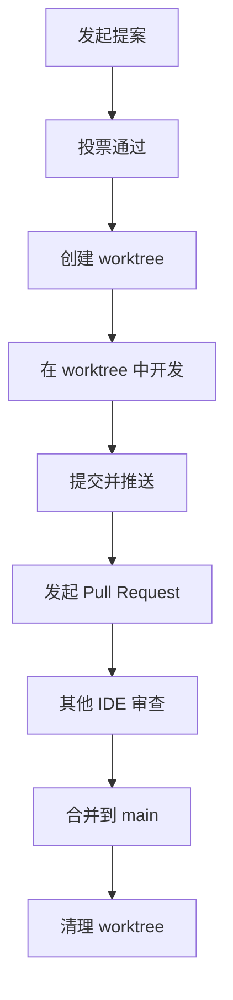

# CloseClaw IDE 协作优化方案

> **版本**: 2.0  
> **创建日期**: 2026-03-13  
> **最后更新**: 2026-03-16  
> **状态**: 🟢 生效中  
> **目标**: 基于现实约束优化 IDE 协作机制

---

## 💡 现实约束与协作模式

**重要前提**：
- 协作主体不是随时在线的智能体
- 用户手动轮换 IDE（各协作主体有限额）
- 不可能让用户整天开着一堆卡的 IDE
- 后期通过 API 转向多智能体架构

**当前策略**：
- ✅ 单 IDE 工作流 - 每次只使用一个 IDE
- ✅ 会话状态保存 - 自动保存/恢复上下文
- ✅ 轻量级切换 - 快速在不同 IDE 间切换
- ✅ ClawHub Skill + Claude Code 插件支持
- ✅ **并行审查** - 多个协作主体可同时审查不同提案（投票通过后实施）

---

## 🎯 批判性思维原则

**所有协作主体必须遵循**：
- ❌ **禁止一味顺从** - 不得无条件赞同所有提案
- ✅ **批判性审查** - 必须提出建设性意见或潜在问题
- ✅ **技术质疑** - 对技术方案、代码质量、安全性提出疑问
- ✅ **替代方案** - 如有更好的实现方式，应主动提出
- ✅ **风险评估** - 识别潜在风险、副作用、边界情况
- ✅ **文档完整性** - 确保提案有足够的文档和测试

---

## 现有架构评估

### 项目架构现状

#### 核心架构（基于 NanoClaw + 原沙箱）

```
┌─────────────────────────────────────────────────────────┐
│              编排层 (TypeScript)                         │
│  - index.ts (消息轮询、任务调度)                         │
│  - channels/ (通道自注册)                                │
│  - db.ts (SQLite 存储)                                   │
│  - router.ts (消息格式化)                                │
└────────────────────┬────────────────────────────────────┘
                     │
                     ▼
┌─────────────────────────────────────────────────────────┐
│              执行层 (JavaScript)                         │
│  - SandboxManager (沙箱管理)                             │
│  - ProcessExecutor (子进程执行)                          │
│  - ToolRegistry (工具注册表)                             │
└────────────────────┬────────────────────────────────────┘
                     │
                     ▼
┌─────────────────────────────────────────────────────────┐
│              LLM 适配器层 (JavaScript)                    │
│  - ClaudeAdapter (直接 API)                              │
│  - OpenAIAdapter                                         │
│  - GeminiAdapter                                         │
│  - LocalAdapter (Ollama)                                │
└─────────────────────────────────────────────────────────┘
```

#### 协作机制现状

**已有文档资源**：

| 文档 | 路径 | 状态 | 复用建议 |
|------|------|------|---------|
| CLOSECLAW_README.md | 根目录 | ✅ 完整 | 完全复用 - 项目概述 |
| COLLABORATION_RULES_v3.md | 根目录 | ✅ 完整 | 完全复用 - 核心协作规则 |
| DOCUMENTATION_SUMMARY.md | 根目录 | ✅ 完整 | 完全复用 - 文档索引 |
| LEGACY_RESOURCES_SUMMARY.md | 根目录 | ✅ 完整 | 完全复用 - 旧项目资源 |
| MIGRATION_SUMMARY.md | 根目录 | ✅ 完整 | 部分复用 - 迁移总结 |
| README.md | 根目录 | ✅ 完整 | 完全复用 - 用户文档 |
| docs/05-architecture/overview.md | docs/ | ✅ 完整 | 完全复用 - 架构文档 |
| docs/03-development/onboarding.md | docs/ | ✅ 完整 | 完全复用 - IDE 引导 |
| docs/02-collaboration/environment.md | docs/ | ✅ 完整 | 完全复用 - 环境规则 |
| docs/04-reference/registration-flow.md | docs/ | ✅ 完整 | 完全复用 - 注册流程 |
| docs/07-roadmap/tasks.md | docs/ | ✅ 完整 | 部分复用 - 任务规划 |

**评估结论**：

- ✅ **文档完整性**: 95% 的文档已创建且内容完整
- ✅ **架构清晰度**: 6 层架构定义清晰，模块职责明确
- ✅ **协作规则**: 投票机制、法定人数、权重分配都已定义
- ⚠️ **待改进**: 缺少具体的 Git 工作流规范和 IDE 实操指南

---

## 强制 Worktree 工作流

### 概述

实施基于 Git Worktree 的强制分支管理工作流，确保代码修改的规范性和可追溯性。

### Worktree 基础概念

**什么是 Git Worktree？**

Git Worktree 允许你在同一个仓库中拥有多个工作目录，每个工作目录可以独立操作不同的分支。

**为什么使用 Worktree？**

1. ✅ **并行开发** - 同时处理多个提案/功能
2. ✅ **分支隔离** - 每个工作目录对应一个分支
3. ✅ **上下文切换** - 快速在不同任务间切换
4. ✅ **减少错误** - 避免在错误分支上提交代码

---

### Worktree 管理规范

#### 1. 工作目录位置（专门的开发目录）

**标准位置**：`~/dev/closeclaw-proposals/`

```
~/dev/
├── closeclaw/                   # 主项目（main 分支）
│   ├── src/
│   ├── docs/
│   ├── scripts/
│   ├── templates/
│   └── .git/
│
├── closeclaw-proposals/         # 所有提案 worktree（标准位置）
│   ├── proposal-001/            # 提案 001 工作目录
│   ├── proposal-002/            # 提案 002 工作目录
│   ├── feature-auth/            # 功能开发工作目录
│   └── bugfix-login/            # Bug 修复工作目录
│
└── closeclaw-votes/             # 投票文档（可选，与主项目分离）
    ├── proposal-001.md
    ├── proposal-002.md
    └── ...
```

**环境变量**：
```bash
# 可以在 .bashrc 或 .zshrc 中设置自定义位置
export CLOSECLAW_WORKTREES_DIR="$HOME/dev/closeclaw-proposals"

# 或在运行时指定
CLOSECLAW_WORKTREES_DIR="/your/custom/path" ./scripts/git-utils.sh create 001 feature-name
```

**优势**：
- ✅ **集中管理** - 所有提案在一个目录
- ✅ **与主项目分离** - 避免混淆
- ✅ **易于备份** - 可以单独备份提案
- ✅ **权限清晰** - 主项目和提案分离

#### 2. 分支命名规范

| 类型 | 命名格式 | 示例 | 说明 |
|------|---------|------|------|
| 主分支 | `main` | `main` | 稳定版本分支 |
| 开发分支 | `develop` | `develop` | 日常开发分支 |
| 提案分支 | `proposal/{编号}` | `proposal/001` | 投票通过的提案 |
| 功能分支 | `feature/{功能名}` | `feature/voting` | 新功能开发 |
| 修复分支 | `bugfix/{问题名}` | `bugfix/login-error` | Bug 修复 |
| 实验分支 | `experiment/{实验名}` | `experiment/sandbox-v2` | 实验性功能 |

#### 3. Worktree 创建流程

**步骤 1: 投票通过后创建工作树**

```bash
# 进入主工作目录
cd .closeclaw/main

# 创建新的 worktree（基于 main 分支）
git worktree add ../worktrees/proposal-001 -b proposal/001

# 验证 worktree 创建成功
git worktree list
```

**步骤 2: 在 worktree 中开发**

```bash
# 进入 worktree 目录
cd ../worktrees/proposal-001

# 进行代码修改
# ... 编辑文件 ...

# 提交更改
git add .
git commit -m "feat: 实现提案 001 的功能"

# 推送到远程
git push -u origin proposal/001
```

**步骤 3: 开发完成后合并**

```bash
# 返回主工作目录
cd ../../main

# 切换到 develop 分支
git checkout develop

# 合并提案分支
git merge proposal/001

# 清理 worktree（可选）
git worktree remove ../worktrees/proposal-001
```

---

### IDE 协作 Worktree 流程

#### 场景 1: 发起代码修改提案



**详细步骤**：

1. **提案阶段**
   ```bash
   # 在投票文档中创建提案
   # 文件：votes/proposal-XXX.md
   ```

2. **投票通过后**
   ```bash
   # 1. 创建 worktree
   git worktree add ../worktrees/proposal-XXX -b proposal/XXX
   
   # 2. 进入 worktree
   cd ../worktrees/proposal-XXX
   
   # 3. 开始开发
   # ... 编写代码 ...
   ```

3. **开发完成**
   ```bash
   # 1. 提交更改
   git add .
   git commit -m "feat: 实现提案 XXX"
   
   # 2. 推送到远程
   git push -u origin proposal/XXX
   
   # 3. 创建 Pull Request
   # 在 GitHub/GitLab 上创建 PR
   ```

4. **审查与合并**
   ```bash
   # 1. 其他 IDE 审查 PR
   # 2. 审查通过后合并
   git checkout main
   git merge proposal/XXX
   
   # 3. 清理 worktree
   cd ..
   git worktree remove proposal-XXX
   ```

---

#### 场景 2: 参与其他 IDE 的提案审查

```bash
# 1. 创建审查用 worktree
git worktree add ../worktrees/review-XXX -b proposal/XXX

# 2. 进入 worktree 审查代码
cd ../worktrees/review-XXX

# 3. 运行测试
npm test

# 4. 查看代码变更
git diff main..proposal/XXX

# 5. 在 PR 中发表评论
# GitHub/GitLab PR 评论

# 6. 审查完成后清理
cd ..
git worktree remove review-XXX
```

---

#### 场景 3: 并行审查多个提案

**说明**: 不同的协作主体可以同时审查不同的提案，各自给出专业意见。

```bash
# 协作主体 A 审查 proposal-001
cd ../worktrees/review-001
git diff main..proposal/001
# 审查代码、运行测试、提出意见
# 在提案文档中填写投票态度和技术评价

# 协作主体 B 审查 proposal-002（并行）
cd ../worktrees/review-002
git diff main..proposal/002
# 独立审查、提出批判性意见
# 可以赞同也可以反对，但必须提供理由
```

**批判性审查要点**：
- 🔍 **技术合理性**: 方案是否最优？有无更好的实现？
- 🔍 **代码质量**: 是否符合规范？有无缝边情况？
- 🔍 **安全性**: 有无安全隐患？输入是否验证？
- 🔍 **性能影响**: 对系统性能有何影响？
- 🔍 **文档完整性**: 是否有足够的注释和文档？
- 🔍 **测试覆盖**: 是否有对应的测试用例？

**注意**: 
- 每个协作主体独立完成审查
- 可以赞同也可以反对，但必须提供技术理由
- 禁止无条件顺从，必须展现批判性思维

---

## 📊 审查质量要求

### 投票时必须提供的信息

**协作主体在投票时必须填写**：
1. **投票态度**: 赞成 / 反对 / 弃权（必须选择）
2. **技术理由**: 为什么支持/反对？（必填）
3. **改进建议**: 如有问题，如何改进？（可选）
4. **风险评估**: 识别的潜在风险（必填）
5. **替代方案**: 是否有更好的实现？（可选）

### 禁止行为

- ❌ **无条件顺从**: "没意见"、"都可以"、"随便"
- ❌ **人身攻击**: 针对提案者而非提案内容
- ❌ **模糊评价**: "感觉不对"、"可能有问题"（必须具体说明）
- ❌ **延迟审查**: 收到审查请求后超过 24 小时无反馈
- ❌ **复制粘贴**: 使用模板化回复，缺乏针对性分析

### 优秀审查示例

**✅ 好的审查意见**：
```
投票：反对
理由：
1. 性能问题：该实现在大数据量下会导致 O(n²) 复杂度，建议使用 HashMap
2. 边界情况：未处理空指针异常，当 input=null 时会崩溃
3. 测试缺失：缺少单元测试覆盖边界条件
改进建议：
- 使用 HashMap 替代 List，将查找复杂度降为 O(1)
- 添加 null 检查和对应的异常处理
- 补充至少 3 个测试用例（正常、边界、异常）
```

**❌ 差的审查意见**：
```
投票：赞成
理由：没意见，挺好的
```

---

---

### Worktree 管理命令速查

| 命令 | 说明 | 示例 |
|------|------|------|
| `git worktree add <路径> <分支>` | 创建新的 worktree | `git worktree add ../worktrees/feat-1 -b feature/1` |
| `git worktree list` | 列出所有 worktree | `git worktree list` |
| `git worktree remove <路径>` | 删除 worktree | `git worktree remove ../worktrees/feat-1` |
| `git worktree prune` | 清理无效的 worktree | `git worktree prune` |
| `git worktree move <旧路径> <新路径>` | 移动 worktree | `git worktree move old-path new-path` |

---

### Worktree 最佳实践

#### ✅ 应该做的

1. **每个提案/功能使用独立 worktree**
   - 保持工作目录清晰
   - 避免代码冲突

2. **定期清理已完成的 worktree**
   ```bash
   # 每周清理一次
   git worktree prune
   ```

3. **使用清晰的命名**
   - `proposal-001` ✅
   - `feat-1` ⚠️
   - `test` ❌

4. **为 worktree 设置独立的 IDE 工作区**
   - VS Code: 为每个 worktree 打开独立窗口
   - 保存为 `.code-workspace` 文件

#### ❌ 不应该做的

1. ❌ **在 main 分支直接开发**
   ```bash
   # 错误做法
   cd main
   git checkout main
   # 直接修改代码...
   ```

2. ❌ **多个功能混在一个 worktree**
   ```bash
   # 错误做法
   cd worktrees/mixed
   # 同时修改多个不相关的功能...
   ```

3. ❌ **长期保留不用的 worktree**
   ```bash
   # 错误做法
   # worktree 堆积，占用大量磁盘空间
   ```

---

## 文档资源复用指南

### 文档分类与复用策略

#### 类别 1: 核心架构文档（完全复用）

**文档列表**：

1. **FINAL_ARCHITECTURE.md**
   - **路径**: `docs/05-architecture/overview.md`
   - **复用建议**: ✅ 完全复用
   - **内容**: 6 层系统架构、核心模块详解
   - **更新频率**: 低（架构稳定后基本不变）

2. **COLLABORATION_RULES_v3.md**
   - **路径**: `根目录/COLLABORATION_RULES_v3.md`
   - **复用建议**: ✅ 完全复用
   - **内容**: 投票规则、权重计算、法定人数
   - **更新频率**: 中（根据协作反馈优化）

**复用方法**：
- 直接引用，无需修改
- 作为新 IDE 的必读文档
- 在 IDE 配置中链接到这些文档

---

#### 类别 2: 协作流程文档（优化后复用）

**文档列表**：

1. **onboarding.md**
   - **路径**: `docs/03-development/onboarding.md`
   - **复用建议**: ✅ 优化后复用
   - **优化点**: 添加 Worktree 流程说明

2. **environment.md**
   - **路径**: `docs/02-collaboration/environment.md`
   - **复用建议**: ✅ 优化后复用
   - **优化点**: 添加 Worktree 环境检查

3. **registration-flow.md**
   - **路径**: `docs/04-reference/registration-flow.md`
   - **复用建议**: ✅ 优化后复用
   - **优化点**: 添加 Worktree 配置步骤

**优化方法**：
- 在现有文档中添加 Worktree 相关章节
- 提供 Worktree 配置示例
- 更新流程图和示例

---

#### 类别 3: 项目文档（部分复用）

**文档列表**：

1. **CLOSECLAW_README.md**
   - **路径**: `根目录/CLOSECLAW_README.md`
   - **复用建议**: ⚠️ 部分复用
   - **复用内容**: 项目概述、核心特性
   - **待更新内容**: 项目结构、快速开始

2. **README.md**
   - **路径**: `根目录/README.md`
   - **复用建议**: ✅ 完全复用
   - **内容**: 用户视角的项目说明
   - **更新频率**: 低

3. **MIGRATION_SUMMARY.md**
   - **路径**: `根目录/MIGRATION_SUMMARY.md`
   - **复用建议**: ⚠️ 部分复用
   - **复用内容**: 迁移总结、架构对比
   - **待归档内容**: 临时性迁移细节

**处理方法**：
- 保留用户视角的文档
- 归档临时性文档到 `docs/archive/`
- 更新项目结构说明

---

#### 类别 4: 历史文档（归档）

**待归档文档**：

1. **DOCUMENTATION_SUMMARY.md**
   - **路径**: `根目录/DOCUMENTATION_SUMMARY.md`
   - **建议**: 归档到 `docs/archive/`
   - **原因**: 已被 docs/README.md 替代

2. **LEGACY_RESOURCES_SUMMARY.md**
   - **路径**: `根目录/LEGACY_RESOURCES_SUMMARY.md`
   - **建议**: 保留但标记为历史
   - **原因**: 对了解项目历史有价值

**归档方法**：
```bash
# 移动文档到归档目录
mv DOCUMENTATION_SUMMARY.md docs/archive/
mv LEGACY_RESOURCES_SUMMARY.md docs/archive/

# 在原位置创建重定向说明
# 文件：DOCUMENTATION_SUMMARY.md
# 内容：本文档已归档，请查看 docs/archive/DOCUMENTATION_SUMMARY.md
```

---

### 文档复用检查清单

在复用文档前，请检查：

- [ ] **文档时效性**: 是否为最新版本？
- [ ] **架构一致性**: 是否与当前架构一致？
- [ ] **链接有效性**: 内部链接是否仍然有效？
- [ ] **示例准确性**: 代码示例是否仍然适用？
- [ ] **依赖关系**: 是否依赖已删除的模块？

---

## IDE 协作流程优化

### 优化后的完整协作流程

#### 阶段 1: 提案发起


**详细步骤**：

1. **环境检查**
   ```bash
   # 1. 检查当前环境
   git status
   git branch
   
   # 2. 确认在正确的分支
   # 应该在 main 或 develop 分支发起提案
   
   # 3. 检查是否有未提交的更改
   # 如有，先提交或暂存
   ```

2. **编写提案文档**
   ```markdown
   # 代码修改提案：[提案名称]
   
   > **提案 ID**: [编号]
   > **提案级别**: [一级/二级/三级]
   > **发起者**: [IDE 名称]
   > **发起日期**: [日期]
   > **状态**: 🟡 投票中
   
   ---
   
   ## 📋 提案说明
   
   [详细描述修改内容、目的、影响范围]
   
   ---
   
   ## 🔗 源码参考
   
   - [ ] 提供源码片段
   - [ ] Git 分支：`proposal/XXX`
   - [ ] 修改文件列表：
     - `src/core/voter.js`
     - `src/core/arbitrator.js`
   
   ---
   
   ## 🗳️ 投票表
   
   [投票表格]
   ```

3. **创建 Worktree 并实现**
   ```bash
   # 1. 创建 worktree
   git worktree add ../worktrees/proposal-XXX -b proposal/XXX
   
   # 2. 进入 worktree
   cd ../worktrees/proposal-XXX
   
   # 3. 实现功能
   # ... 编写代码 ...
   
   # 4. 提交但不推送（等待投票通过）
   git add .
   git commit -m "feat: 实现提案 XXX"
   ```

---

#### 阶段 2: 投票参与


**详细步骤**：

1. **阅读提案**
   ```bash
   # 1. 阅读提案文档
   cat ../../votes/proposal-XXX.md
   
   # 2. 查看提案级别和法定人数
   # 确定需要多少 IDE 参与
   ```

2. **审查源码**
   ```bash
   # 1. 创建审查用 worktree
   git worktree add ../worktrees/review-XXX -b proposal/XXX
   
   # 2. 进入 worktree
   cd ../worktrees/review-XXX
   
   # 3. 查看代码变更
   git diff main..proposal/XXX
   
   # 4. 运行测试（如有）
   npm test
   
   # 5. 检查代码质量
   npm run lint
   ```

3. **投票**
   - 在提案文档中填写投票态度
   - 如反对，必须提供理由
   - 可提出改进建议

---

#### 阶段 3: 投票执行


**详细步骤**：

1. **投票通过后**
   ```bash
   # 1. 进入提案 worktree
   cd ../worktrees/proposal-XXX
   
   # 2. 确保代码是最新的
   git pull origin proposal/XXX
   
   # 3. 推送到远程
   git push -u origin proposal/XXX
   ```

2. **创建 Pull Request**
   - 在 GitHub/GitLab 创建 PR
   - 链接到投票文档
   - 说明修改内容和影响

3. **最终审查**
   ```bash
   # 其他 IDE 审查 PR
   # 1. 创建审查 worktree
   git worktree add ../worktrees/pr-review-XXX -b proposal/XXX
   
   # 2. 审查代码
   # 3. 在 PR 中发表评论
   ```

4. **合并与清理**
   ```bash
   # 1. 合并到 main
   git checkout main
   git merge proposal/XXX
   
   # 2. 推送到远程
   git push origin main
   
   # 3. 清理 worktree
   cd ..
   git worktree remove proposal-XXX
   
   # 4. 删除远程分支（可选）
   git push origin --delete proposal/XXX
   ```

---

### 协作效率提升建议

#### 1. 自动化检查

**Git Hooks 配置**：

创建 `.husky/pre-commit` 文件：

```bash
#!/bin/sh

# 检查是否在正确的分支
current_branch=$(git branch --show-current)
if [ "$current_branch" = "main" ]; then
  echo "❌ 禁止直接在 main 分支提交！"
  echo "请创建 worktree 并在提案分支开发"
  exit 1
fi

# 运行代码检查
npm run lint

# 运行测试
npm test
```

**安装 Hooks**：

```bash
# 安装 Husky
npm install husky --save-dev
npx husky install

# 添加 pre-commit hook
npx husky add .husky/pre-commit "npm run lint && npm test"
```

---

#### 2. IDE 配置优化

**VS Code 工作区配置**：

创建 `.vscode/workspaces.code-workspace`：

```json
{
  "folders": [
    {
      "name": "main",
      "path": "../main"
    },
    {
      "name": "proposal-001",
      "path": "../worktrees/proposal-001"
    },
    {
      "name": "proposal-002",
      "path": "../worktrees/proposal-002"
    }
  ],
  "settings": {
    "git.autofetch": true,
    "git.confirmSync": false
  }
}
```

---

#### 3. 文档模板

**提案文档模板**：

创建 `templates/proposal-template.md`：

```markdown
# 代码修改提案：[提案名称]

> **提案 ID**: [自动编号]
> **提案级别**: [一级/二级/三级]
> **发起者**: [@IDE 名称]
> **发起日期**: [YYYY-MM-DD]
> **状态**: 🟡 投票中
> **Worktree 分支**: `proposal/[编号]`

---

## 📋 提案说明

### 背景
[为什么需要这个修改？]

### 目标
[这个修改要达到什么目的？]

### 实现方案
[如何实现？技术方案是什么？]

### 影响范围
[会影响哪些模块？]

### 风险评估
[有什么潜在风险？如何缓解？]

---

## 🔗 源码参考

- **Git 分支**: `proposal/[编号]`
- **Worktree 路径**: `../worktrees/proposal-[编号]`
- **修改文件列表**:
  - [ ] `src/core/voter.js` - [修改说明]
  - [ ] `src/core/arbitrator.js` - [修改说明]
  - [ ] `tests/voter.test.js` - [测试文件]

---

## 🗳️ 投票表

### IDE 投票

| IDE | 态度 | 得分 | 备注 |
|-----|------|------|------|
| [IDE1] | ⬜ | 0 | |
| [IDE2] | ⬜ | 0 | |

**统计**:
- 参与数：0/17
- 赞同数：0
- 反对数：0
- IDE 总得分：0

---

### 用户投票

| 用户 | 态度 | 得分 | 备注 |
|-----|------|------|------|
| 用户 | ⬜ | 0 | |

**统计**:
- 参与：是/否
- 用户得分：0

---

## 📊 最终统计

| 项目 | 值 |
|------|-----|
| IDE 总得分 | 0 |
| 用户得分 | 0 |
| 综合总票数 | 0 |
| 反对票数量 | 0 |
| 法定人数 | 是/否 |
| **通过状态** | ⬜ |

---

## 💬 讨论区

[在此发表讨论意见]

---

## 📝 更新日志

- [日期] - 创建提案
- [日期] - 更新 [内容]
```

---

#### 4. 快速命令

创建 `scripts/git-utils.sh`：

```bash
#!/bin/bash

# CloseClaw Git 工具脚本

# 创建新的提案 worktree
create_proposal() {
  local id=$1
  local name=$2
  
  if [ -z "$id" ] || [ -z "$name" ]; then
    echo "用法：create_proposal <编号> <名称>"
    return 1
  fi
  
  git worktree add ../worktrees/proposal-$id -b proposal/$id
  echo "✅ 已创建 worktree: proposal-$id"
  echo "📂 路径：../worktrees/proposal-$id"
}

# 清理已完成的 worktree
cleanup_proposal() {
  local id=$1
  
  if [ -z "$id" ]; then
    echo "用法：cleanup_proposal <编号>"
    return 1
  fi
  
  git worktree remove ../worktrees/proposal-$id
  echo "✅ 已清理 worktree: proposal-$id"
}

# 列出所有 worktree
list_worktrees() {
  echo "📋 当前 worktrees:"
  git worktree list
}

# 切换到指定 worktree
switch_worktree() {
  local name=$1
  
  if [ -z "$name" ]; then
    echo "用法：switch_worktree <名称>"
    return 1
  fi
  
  cd ../worktrees/$name
  echo "✅ 已切换到：$name"
}

# 显示帮助
show_help() {
  echo "CloseClaw Git 工具"
  echo ""
  echo "用法:"
  echo "  create_proposal <编号> <名称>  - 创建提案 worktree"
  echo "  cleanup_proposal <编号>        - 清理提案 worktree"
  echo "  list_worktrees                 - 列出所有 worktree"
  echo "  switch_worktree <名称>         - 切换到指定 worktree"
  echo "  help                           - 显示帮助"
}

# 主程序
case "$1" in
  create)
    create_proposal "$2" "$3"
    ;;
  cleanup)
    cleanup_proposal "$2"
    ;;
  list)
    list_worktrees
    ;;
  switch)
    switch_worktree "$2"
    ;;
  *)
    show_help
    ;;
esac
```

**使用方法**：

```bash
# 添加执行权限
chmod +x scripts/git-utils.sh

# 创建提案
./scripts/git-utils.sh create 001 voting-feature

# 列出 worktrees
./scripts/git-utils.sh list

# 切换 worktree
./scripts/git-utils.sh switch proposal-001
```

---

## 🔗 相关文档

- [协作规则](../../RULES.md)
- [协作主体引导](../03-development/onboarding.md)
- [环境拓扑与进度提取](./environment.md)
- [新 IDE 注册流程](../04-reference/registration-flow.md)
- [架构概览](../05-architecture/overview.md)
- [未来规划](../07-roadmap/future-plan.md)

---

> **CloseClaw - 公平、透明、高效的多智能体协作** 🚀
