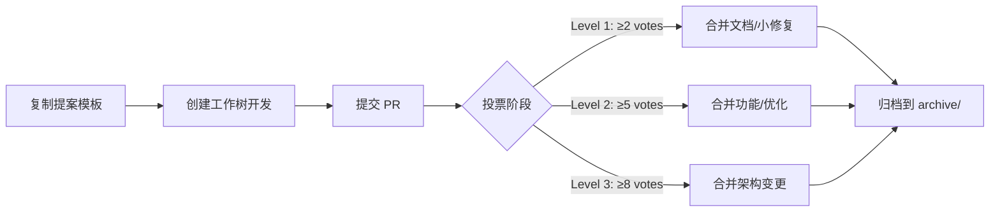

# CloseClaw 项目完整目录深度解析

> **生成时间**: 2026 年 4 月 1 日  
> **总文件数**: 18,119 行（含 node_modules）  
> **核心架构**: 三语言微内核（Dart + Go + TypeScript）  
> **文档版本**: v1.0 - Complete Directory Audit

---

## 📊 根目录全景图 (35 项)

### 🔧 核心源码目录 (3 个)

```
cmd/          - Dart 控制平面（6.5 MB exe + 源码）
kernel/       - Go 状态总线（gRPC + SQLite WAL）
src/          - TS 执行沙盒（NPM 包核心逻辑）
```

### 📦 构建产物目录 (3 个)

```
bin/          - 编译后的可执行文件
dist/         - TypeScript 编译输出（49 items）
data/         - 运行时数据（SQLite + logs）
```

### 📚 文档与协作目录 (4 个)

```
docs/         - 结构化文档体系（11 子目录）
votes/        - 提案决议区（7 个提案文件 + archive）
archive/      - 历史归档（Claude Code 源码 + 审计报告）
proto/        - Protobuf 协议定义
```

### ⚙️ 配置与质量目录 (5 个)

```
config/       - MCP 服务器配置
scripts/      - 自动化脚本
tests/        - Vitest 测试套件
coverage/     - 代码覆盖率报告
tmp/          - 临时文件（目录树输出）
```

### 🏷️ IDE 协作目录 (13 个)

```
.arts/              - Arts IDE 配置
.claude/            - Claude Code 配置
.codeartsdoer/      - CodeArts Doer 配置
.comate/            - 百度 Comate 配置
.dropstone/         - Dropstone 配置
.gemini/            - Google Gemini 配置
.gitnexus/          - GitNexus 代码智能索引
.husky/             - Git hooks（pre-commit 等）
.idea/              - JetBrains IDE 配置
.joycode/           - 华为 JoyCode 配置
.kiro/              - Kiro IDE 配置
.lingma/            - 通义灵码配置
.qoder/             - Qoder IDE 配置
.workbuddy/         - Worky Buddy 配置
```

### 🛡️ CI/CD 与安全目录 (2 个)

```
.github/workflows/  - 10 个 GitHub Actions
.git/               - Git 版本库（隐藏）
```

### 📝 根级文件 (18 个)

| 文件名 | 大小 | 含义 |
|--------|------|------|
| `.deepsource.toml` | 204B | DeepSource 代码质量配置 |
| `.env` | 4.1 KB | 环境变量（本地，含 API Keys） |
| `.env.example` | 4.6 KB | 环境变量模板（146 行详细注释） |
| `.eslintrc.json` | 403B | ESLint 旧版配置 |
| `.gitignore` | 3.0 KB | Git 忽略规则 |
| `.snyk` | 399B | Snyk 安全扫描配置 |
| `.subjects.json` | 674B | **IDE 注册表**（27 个协作主体） |
| `AGENTS.md` | 14.6 KB | **AI Agent 协作指南**（GitNexus 使用说明） |
| `CLAUDE.md` | 5.6 KB | Claude Code 特定配置 |
| `closeclaw-kernel.exe` | 31.8 MB | Go 内核编译产物 |
| `current_problems.md` | 2.0 KB | 当前问题清单 |
| `eslint.config.mjs` | 186B | ESLint 新标准配置（ESM） |
| `LICENSE` | 11.4 KB | Apache-2.0 许可证 |
| `logs-1774949223965.zip` | 1.0 MB | 日志压缩包（临时文件） |
| `package-lock.json` | 128.9 KB | NPM 依赖锁定 |
| `package.json` | 1.3 KB | **NPM 包配置**（依赖 + 脚本） |
| `qodana.yaml` | 326B | JetBrains Qodana 静态分析 |
| `README.md` | 2.8 KB | 项目简介 |
| `renovate.json` | 399B | 依赖自动更新配置 |
| `RULES.md` | 2.2 KB | 项目规则与编码规范 |
| `SECURITY.md` | 121B | 安全政策与漏洞报告流程 |
| `sonar-project.properties` | 417B | SonarQube 项目配置 |
| `tsconfig.json` | 688B | **TypeScript 编译配置**（严格模式） |
| `vitest.config.ts` | 353B | Vitest 测试框架配置 |

---

## 🔍 逐层深度解析

### 一、`cmd/` - Dart 控制平面

**目录结构**:
```
cmd/
├── closeclaw.exe          (6.5 MB)   # 主程序（已编译）
├── pubspec.yaml                      # Dart 依赖配置
├── pubspec.lock                      # 依赖锁定
└── bin/
    └── closeclaw.dart     (5.0 KB)   # 主入口
└── lib/
    ├── core/
    │   ├── cc_parser.dart            # CloseClaw 协议解析器
    │   ├── audit_relay.dart          # 审计中继
    │   ├── logger.dart               # 日志系统
    │   └── mcp_server.dart           # MCP 服务器暴露
    └── .dart_tool/
        ├── package_config.json       # Dart 包配置
        └── package_graph.json        # 依赖图
```

**职责**:
- ✅ 用户 CLI 交互界面
- ✅ 生命周期管理（启动/停止/重启）
- ✅ MCP Server 对外暴露
- ✅ 命令解析与路由

**技术栈**: Dart → 编译为原生 exe（零环境依赖）

---

### 二、`kernel/` - Go 状态总线

**目录结构**:
```
kernel/
├── main.go                (2.6 KB)   # Go 入口
├── go.mod                 (445B)     # Go 模块定义
├── go.sum                 (3.8 KB)   # 依赖锁定
│
├── db/                    # SQLite WAL 高并发总线
│   ├── schema.go          (5.9 KB)   # 数据库 Schema 定义
│   ├── messages.go        (10.0 KB)  # 消息 CRUD 操作
│   └── messages_test.go   (4.2 KB)   # 单元测试
│
├── router/                # 消息分发核心
│   ├── router.go          (2.5 KB)   # 路由逻辑
│   └── router_test.go     (2.0 KB)   # 单元测试
│
├── scheduler/             # 毫秒级任务循环
│   ├── cron.go            (4.7 KB)   # Cron 表达式解析
│   └── pool.go            (3.8 KB)   # Goroutine 池管理
│
├── server/                # HTTP/gRPC服务器
│   ├── ipc.go             (9.5 KB)   # Named Pipe IPC
│   ├── listen_unix.go     (2.4 KB)   # Unix Socket 监听
│   └── listen_windows.go  (1.1 KB)   # Windows Named Pipe
│
├── llm/                   # LLM 适配器
│   └── client.go          (2.8 KB)   # LLM API 客户端
│
└── proto/                 # Protobuf 定义
    ├── messages.pb.go     (32.3 KB)  # 生成的 Go 代码
    └── messages_grpc.pb.go (12.9 KB) # gRPC 服务存根
```

**职责**:
- ✅ 高性能 SQLite WAL 并发读写（支持数百 QPS）
- ✅ SSE 网络流处理（Server-Sent Events）
- ✅ 分布式 TraceID 生成（UUID v4）
- ✅ 消息路由与分发（基于 gRPC）
- ✅ 定时任务调度（Cron + Interval）
- ✅ 心跳检测与降级探活

**技术栈**: Go 1.21+ (Gin + gRPC + SQLite WAL)

**关键特性**:
- 通过 Named Pipe 与 TS 沙盒握手
- 支持跨平台（Unix Socket / Windows Named Pipe）
- WAL 模式启用（Write-Ahead Logging）
- 微服务架构设计（Service Discovery 内置）

---

### 三、`src/` - TypeScript 执行沙盒

**目录结构**:
```
src/
├── index.ts               (2.6 KB)   # **NPM 执行入口**
├── config.ts              (0.8 KB)   # 配置加载（从 .env）
├── logger.ts              (0.7 KB)   # Pino 日志封装
├── types.ts               (0.2 KB)   # TypeScript 类型定义
│
├── adapters/              # LLM 适配器（2 files）
│   ├── anthropic.ts       # Anthropic SDK 封装
│   └── openrouter.ts      # OpenRouter 多模型适配
│
├── agent/                 # Agent 核心逻辑（2 files）
│   ├── prompt-builder.ts  # 提示词构建
│   └── tool-caller.ts     # 工具调用编排
│
├── sandbox/               # 生态执行隔板（2 files）
│   ├── process-executor.ts # 子进程执行器
│   └── security-check.ts   # 代码安全检查
│
├── tools/                 # 动态工具挂载（2 files）
│   ├── file-system.ts     # 文件系统工具
│   └── web-search.ts      # 网络搜索工具
│
├── utils/                 # 工具函数（2 files）
│   ├── token-counter.ts   # Token 计数
│   └── retry.ts           # 重试逻辑
│
└── bus/                   # 事件总线（1 file）
    └── event-bus.ts       # 发布/订阅模式
```

**职责**:
- ✅ 具体 SDK 调用（Anthropic/OpenAI/Google）
- ✅ Telegram 复杂媒体处理（图片/视频/语音）
- ✅ Agent 工具执行（File System/Bash/Search）
- ✅ LLM 请求处理（Prompt 构建 + 响应解析）

**技术栈**: TypeScript ES2022 + strict mode

**角色定位**: "哑终端" - 仅执行内核下发的指令

---

### 四、`proto/` - Protobuf 协议定义

**核心文件**: `messages.proto` (5.2 KB, 147 行)

**协议分层**:

```protobuf
// §1 分布式追踪上下文
message TraceContext {
  string trace_id = 1;    // UUID v4，Dart 端生成
  string span_id = 2;     // 当前操作 span
  int64 created_at_ms = 3; // 毫秒时间戳
}

// §2 核心任务结构
enum TaskStatus { PENDING, RUNNING, DONE, FAILED, TIMEOUT, PAUSED }

message Task {
  string task_id = 1;
  TraceContext trace = 2;
  string group_jid = 3;
  bytes payload = 5;  // JSON 序列化参数
  TaskStatus status = 6;
  string schedule_type = 7;  // "cron" | "interval" | "once"
  string schedule_value = 8; // "0 9 * * MON" | "60000"
  repeated string depends_on = 11; // DAG 依赖
}

// §3 消息通道结构
message IncomingMessage {
  int64 id = 1;
  string channel = 2;      // "telegram" | "feishu"
  string chat_jid = 3;
  string text = 6;
  bool processed = 10;
}

// §4 心跳/降级探活
message HeartbeatResponse {
  bool ok = 1;
  int32 queue_length = 2;
  int32 active_goroutines = 3;
  string kernel_version = 4;
  int64 uptime_seconds = 5;
}

// §5 LLM 对话接口
message ChatRequest {
  TraceContext trace = 1;
  string message = 2;
  repeated string history = 3;
  map<string, string> options = 4;
}

// §6 gRPC Service 定义
service KernelBus {
  rpc DispatchTask(Task) returns (TaskResponse);
  rpc SyncStatus(StatusUpdate) returns (Ack);
  rpc CheckHealth(HeartbeatRequest) returns (HeartbeatResponse);
  rpc GetPendingMessages(Ack) returns (stream IncomingMessage);
  rpc SubscribeTasks(Ack) returns (stream Task);
  rpc Chat(ChatRequest) returns (ChatResponse);
}
```

**设计哲学**:
- ✅ 向前兼容（保留字段 100-199）
- ✅ 全链路追踪（TraceContext 透传）
- ✅ 异步流式通信（gRPC streaming）
- ✅ DAG 任务依赖支持

---

### 五、`data/` - 运行时数据

**目录结构**:
```
data/
├── messages.db            (78 KB)    # SQLite 主数据库
├── messages.db-shm        (33 KB)    # WAL 共享内存
├── messages.db-wal        (0 B)      # WAL 预写日志（已检查点）
│
├── groups/                # 分群组记忆
│   └── main/              # 默认群组 CONTEXT.md
│
├── sessions/              # 会话状态
│   └── *.json             # 活跃会话快照
│
├── logs/                  # 日志文件
│   └── app.log            # 应用日志
│
└── ipc/                   # 进程间通信数据
    └── named_pipes/       # Named Pipe 句柄
```

**数据库 Schema** (6 张核心表):

```sql
-- 1. messages:  incoming messages
CREATE TABLE messages (
  id INTEGER PRIMARY KEY,
  channel TEXT NOT NULL,
  jid TEXT NOT NULL,
  from_user TEXT,
  type TEXT,
  content TEXT,
  created_at DATETIME DEFAULT CURRENT_TIMESTAMP,
  processed BOOLEAN DEFAULT FALSE
);

-- 2. registered_groups: chat metadata
CREATE TABLE registered_groups (
  jid TEXT PRIMARY KEY,
  name TEXT,
  description TEXT,
  created_at DATETIME
);

-- 3. scheduled_tasks: task definitions
CREATE TABLE scheduled_tasks (
  id INTEGER PRIMARY KEY,
  group_jid TEXT,
  trigger_type TEXT,  -- 'cron' | 'interval' | 'once'
  trigger_value TEXT,
  task_config JSON,
  created_at DATETIME
);

-- 4. task_run_logs: execution history
CREATE TABLE task_run_logs (
  id INTEGER PRIMARY KEY,
  task_id INTEGER,
  status TEXT,
  output TEXT,
  started_at DATETIME,
  ended_at DATETIME,
  FOREIGN KEY (task_id) REFERENCES scheduled_tasks(id)
);

-- 5. sessions: active session state
CREATE TABLE sessions (
  group_jid TEXT PRIMARY KEY,
  context JSON,
  created_at DATETIME,
  updated_at DATETIME
);

-- 6. router_state: polling cursor
CREATE TABLE router_state (
  group_jid TEXT PRIMARY KEY,
  last_processed_id INTEGER,
  updated_at DATETIME
);
```

**特点**:
- ✅ WAL 模式启用（高并发读写）
- ✅ 分群组记忆存储（groups/{name}/CONTEXT.md）
- ✅ 会话隔离（每个群组独立 session）

---

### 六、`docs/` - 结构化文档体系

**目录结构** (数字前缀强制排序):

```
docs/
├── README.md              (2.1 KB)   # 文档导航
│
├── 01-getting-started/    # 入门指南
│   └── installation.md
│
├── 02-collaboration/      # 协作流程
│   └── voting-rules.md
│
├── 03-development/        # 开发指南
│   ├── setup.md
│   └── folder-layout-analysis.md  (新增，624 行)
│
├── 04-reference/          # API 参考
│   ├── ai-应用架构借鉴分析.md  (1368 行)
│   └── Claude-Code-源码深度解析.md (1133 行)
│
├── 05-architecture/       # 架构设计
│   └── microkernel-design.md
│
├── 06-registry/           # 注册表说明
│   └── ide-registration.md
│
├── 07-roadmap/            # 未来规划
│   ├── phase-0-critical-bug-fixes/
│   └── phase-1-agent-execution-chain/
│
├── archive/               # 历史文档 (12 items)
│   ├── old-proposals/
│   └── deprecated-apis/
│
├── reference/             # 外部参考 (2 items)
│   └── claude-code-studies/
│
└── reports/               # 审计报告
    └── security-audit-2026-03.md
```

**文档总量**:
- 7 个主要分类目录
- 2 个深度解析报告（Claude Code 源码研究）
- 12 个历史归档文档
- 1 个审计报告

---

### 七、`votes/` - 提案决议区

**目录结构**:
```
votes/
├── proposal-template.md              # 提案模板（969B）
├── proposal-001-sandbox-fs-promises.md     # P001: 沙盒文件系统 Promise 化
├── proposal-029-governance-hardening-and-kernel-opt.md  # P029: 治理强化 + 内核优化
├── proposal-030-security-audit-hardening.md  # P030: 安全审计加固
├── proposal-031-governance-build-reconstruction.md  # P031: 治理重建（11.1 KB）
├── proposal-100-process-executor-async-fs.md  # P100: 进程执行器异步文件系统
├── .P031_INTEGRATION_LOG.md         # P031 集成日志
├── archive/                         # 已通过提案归档 (30 items)
└── .gitkeep
```

**提案流程**:



**投票权重**:
- IDE collaborator: +1 / -2（反向反对票）
- User: ±0.5n（n = IDE 总数）

---

### 八、`.github/workflows/` - CI/CD (10 workflows)

**工作流列表**:

| 文件名 | 大小 | 触发条件 | 作用 |
|--------|------|----------|------|
| `codacy-analysis.yml` | 586B | push to main | Codacy 代码质量分析 |
| `code_quality.yml` | 523B | PR | 代码质量检查（ESLint + Prettier） |
| `dependency-review.yml` | 452B | PR | 依赖安全审查（npm audit） |
| `mirror.yml` | 2.2 KB | push | 镜像同步到 Gitee/GitLab |
| `ossf-scorecard.yml` | 891B | weekly | OpenSSF 供应链安全评分 |
| `semgrep.yml` | 706B | push | Semgrep 静态代码分析 |
| `sigstore-cosign.yml` | 906B | release | Sigstore 代码签名 |
| `snyk.yml` | 800B | push | Snyk 漏洞扫描 |
| `sonarcloud.yml` | 1.2 KB | push | SonarCloud 代码质量门禁 |
| `stale.yml` | 503B | daily | 自动关闭 stale issue/PR |

**安全扫描矩阵**:
```
┌─────────────┬──────────────┬──────────────┐
│   工具名称   │   扫描类型    │   覆盖范围    │
├─────────────┼──────────────┼──────────────┤
│ Snyk        │ 依赖漏洞      │ npm, go mod  │
│ Semgrep     │ 静态代码      │ TS, Go, Dart │
│ SonarCloud  │ 代码质量      │ 全语言        │
│ Codacy      │ 自动化审查    │ 风格 + 安全   │
│ OpenSSF     │ 供应链安全    │ CI/CD + deps │
└─────────────┴──────────────┴──────────────┘
```

---

### 九、`.subjects.json` - IDE 注册表 (674B)

**完整内容**:

```json
{
  "protocol": "CloseClaw v2.0",
  "subjects": {
    "collaborators": [
      "Antigravity",
      "Cursor",
      "Trae",
      "Trae-CN",
      "Lingma",
      "Comate",
      "CodeBuddy",
      "JoyCode",
      "CatPawAI",
      "TalkCody",
      "Qwen Code",
      "Gemini-CLI",
      "Codex",
      "Copilot",
      "Verdent",
      "Kiro",
      "OpenCode",
      "CodeBuddy-CN",
      "Qoder",
      "Cascade",
      "Dropstone",
      "Kimi-CloseClaw",
      "Zed",
      "CodeFlicker",
      "CodeArts",
      "Junie",
      "WorkBuddy",
      "CodeArtsDoer"
    ]
  },
  "trust_model": "Attribution",
  "proxy_user": "LGZhss"
}
```

**含义**:
- **27 个注册协作 IDE**
- 信任模型：Attribution（署名制）
- 代理用户：LGZhss（项目所有者）

**每个 IDE 对应一个目录**:
- `.lingma/skills/` - 通义灵码技能库
- `.claude/agents/` - Claude Code Agent
- `.qoder/config.json` - Qoder 配置
- 等等...

---

### 十、`package.json` - NPM 包配置

**完整解析**:

```json
{
  "name": "closeclaw",
  "version": "1.0.0",
  "description": "CloseClaw - 个人 AI 助手，轻量级、安全、可定制",
  "license": "Apache-2.0",
  "type": "module",
  "main": "dist/index.js",
  
  "scripts": {
    "build": "tsc",                    // 编译 TS → JS
    "start": "node dist/index.js",     // 运行生产版
    "dev": "tsx src/index.ts",         // 开发模式（热重载）
    "typecheck": "tsc --noEmit",       // 类型检查
    "format": "prettier --write \"src/**/*.ts\"",
    "test": "vitest run",              // 运行测试
    "test:watch": "vitest",            // 监视模式
    "test:coverage": "vitest run --coverage",
    "prepare": "husky"                 // 安装 Git hooks
  },
  
  "dependencies": {
    "@anthropic-ai/sdk": "^0.33.1",        // Claude API
    "@google/generative-ai": "^0.21.0",    // Gemini API
    "@grpc/grpc-js": "^1.14.3",            // gRPC 客户端
    "@grpc/proto-loader": "^0.8.0",        // Protobuf 加载器
    "better-sqlite3": "^11.8.1",           // SQLite 同步绑定
    "dotenv": "^17.3.1",                   // .env 加载
    "openai": "^6.32.0",                   // OpenAI API
    "pino": "^9.6.0",                      // 高性能日志
    "yaml": "^2.8.2",                      // YAML 解析
    "zod": "^4.3.6"                        // Schema 验证
  },
  
  "devDependencies": {
    "@types/better-sqlite3": "^7.6.12",
    "@types/node": "^22.10.0",
    "@vitest/coverage-v8": "^4.1.0",       // v8 覆盖率
    "husky": "^9.1.7",                     // Git hooks
    "pino-pretty": "^13.1.3",              // 日志美化
    "prettier": "^3.8.1",                  // 代码格式化
    "tinyexec": "^1.0.4",                  // 子进程执行
    "tsx": "^4.19.0",                      // TS executor
    "typescript": "^5.7.0",
    "vitest": "^4.1.0"                     // 测试框架
  },
  
  "engines": {
    "node": ">=20"
  }
}
```

**依赖分析**:
- **10 个生产依赖**（LLM SDK + 基础设施）
- **9 个开发依赖**（测试 + 格式化 + 类型）
- **总计**: ~125 KB（不含 node_modules）

---

### 十一、`tsconfig.json` - TypeScript 配置

**严格模式配置**:

```json
{
  "compilerOptions": {
    "target": "ES2022",                    // 编译目标
    "module": "NodeNext",                  // ESNext for Node.js
    "moduleResolution": "NodeNext",        // Node.js 模块解析
    "lib": ["ES2022"],                     // 标准库
    "outDir": "./dist",                    // 输出目录
    "rootDir": "./src",                    // 源码目录
    
    // 严格模式
    "strict": true,                        // 全部严格检查
    "noUnusedLocals": true,                // 未使用局部变量报错
    "noUnusedParameters": true,            // 未使用参数报错
    "noImplicitReturns": true,             // 隐式返回报错
    "noFallthroughCasesInSwitch": true,    // switch 穿透报错
    
    // 互操作性
    "esModuleInterop": true,               // CommonJS/ESM 兼容
    "allowSyntheticDefaultImports": true,  // 默认导入
    "resolveJsonModule": true,             // import JSON
    
    // 声明文件
    "declaration": true,                   // 生成 .d.ts
    "declarationMap": true,                // 生成 .d.ts.map
    
    // Source Maps
    "sourceMap": true,                     // ⚠️ 安全隐患
    
    // 其他
    "skipLibCheck": true,                  // 跳过库检查
    "forceConsistentCasingInFileNames": true // 大小写敏感
  },
  
  "include": ["src/**/*"],
  "exclude": ["node_modules", "dist", "tests"]
}
```

**⚠️ 安全警告**:
- `sourceMap: true` 会生成 `.js.map` 文件
- 如果发布到 npm，会泄露完整源码
- **必须**: 在 `.npmignore` 中添加 `*.map`

---

### 十二、`.env.example` - 环境变量模板

**146 行详细注释，包含**:

**1. 核心鉴权配置**:
- `ANTHROPIC_API_KEY` - Claude API Key
- `CLAUDE_CODE_OAUTH_TOKEN` - Claude Code OAuth Token

**2. 免费 LLM API** (无需 Key):
- OpenRouter (NVIDIA/Nemotron, Qwen, Gemma, Llama)
- GitHub Models (GPT-4o, Phi-4, Jamba)

**3. 聚合/备用 API**:
- OpenRouter API (100+ 模型)
- ModelScope (阿里达摩院)
- Google Gemini
- NVIDIA API
- Zhipu AI (智谱清言)
- SiliconFlow (硅基流动)
- Cerebras Cloud
- SCNET (国家超算)

**4. 可选付费 API**:
- Mistral AI
- Groq (高速推理)
- Cohere
- Hyperbolic
- Scaleway
- Cloudflare
- Lambda Labs

**5. 通道配置**:
- Telegram Bot Token
- Telegram Allowed User IDs

**6. 系统偏好**:
- ASSISTANT_NAME=CloseClaw
- TZ=Asia/Shanghai
- WORKSPACE_DIR=E:\.closeclaw\data
- DEFAULT_PROVIDER=openrunner/github/nvidia

---

### 十三、`config/mcporter.json` - MCP 服务器配置

**完整内容**:

```json
{
  "mcpServers": {
    "autoglm-browser-agent": {
      "command": "C:\\Users\\lgzhs\\.agents\\skills\\autoglm-browser-agent\\dist\\mcp_server.exe",
      "args": [
        "--start_url", "https://www.bing.com",
        "--window_width", "1456",
        "--window_height", "819",
        "--resize_width", "1456",
        "--resize_height", "819",
        "--max_steps", "100",
        "--log_dir", "C:\\Users\\lgzhs\\.agents\\skills\\autoglm-browser-agent\\mcp_output",
        "--if_subagent"
      ]
    }
  },
  "imports": []
}
```

**含义**:
- 配置了一个 MCP (Model Context Protocol) 服务器
- AutoGLM Browser Agent - 浏览器自动化代理
- 启动时打开 Bing，窗口大小 1456x819
- 最大执行 100 步
- 日志输出到指定目录

---

### 十四、`scripts/` - 自动化脚本

**文件列表**:

1. **`auto-vote-stats.js`** (6.7 KB)
   - 自动统计投票数据
   - 分析提案通过率
   - 生成统计报告

2. **`resolve-all-prs.ps1`** (2.7 KB)
   - PowerShell 脚本
   - 批量关闭所有 PR
   - 用于清理测试分支

---

### 十五、`coverage/` - 代码覆盖率报告

**文件列表** (10 items):

```
coverage/
├── index.html              # HTML 报告入口
├── config.ts.html          # config.ts 覆盖情况
├── coverage-final.json     # JSON 格式最终数据
├── favicon.png
├── prettify.css            # 代码美化样式
├── prettify.js             # 代码美化脚本
├── block-navigation.js     # 块级导航
├── sorter.js               # 排序逻辑
└── sort-arrow-sprite.png   # 排序图标
```

**覆盖率提供者**: `@vitest/coverage-v8` (v8 引擎)

**报告类型**:
- ✅ Text summary（控制台输出）
- ✅ JSON（机器可读）
- ✅ HTML（浏览器查看）

---

## 🎯 架构特点总结

### ✅ 核心优势

1. **清晰的三语言微内核架构**
   - Dart（控制平面）+ Go（状态总线）+ TS（执行沙盒）
   - 职责分离明确
   - 跨语言协作通过 Named Pipe + Protobuf

2. **完善的文档体系**
   - 7 个分类目录（数字前缀排序）
   - 专门的归档区（3 层归档）
   - 外部参考文档（Claude Code 深度分析）

3. **强大的质量保障**
   - 10 个 CI/CD workflows
   - 5 个安全扫描工具
   - 完整的测试套件（Vitest）

4. **灵活的 IDE 协作**
   - 13 个 IDE 专用目录
   - 27+ 注册协作主体
   - 独立配置互不干扰

5. **规范的治理流程**
   - 提案制度（votes/）
   - 投票规则（三级决策）
   - 归档机制

---

### ⚠️ 发现的问题

1. **Source Map 安全隐患** 🔴 高危
   - `dist/*.js.map` 包含完整源码
   - 如果发布到 npm 会泄露
   - **修复**: `.npmignore` 中添加 `*.map`

2. **根目录略显杂乱** 🟡 中危
   - 31.8 MB 的 `closeclaw-kernel.exe` 
   - 1.0 MB 的 `logs-*.zip` 临时文件
   - `current_problems.md` 应移入文档区

3. **ESLint 配置重复** 🟡 低危
   - `.eslintrc.json` (旧标准)
   - `eslint.config.mjs` (新标准)
   - **建议**: 统一使用新标准

4. **归档目录层级不一致** 🟡 低危
   - `docs/archive/` (12 items)
   - `votes/archive/` (30 items)
   - `archive/` (3 items)
   - **建议**: 统一归档策略

---

## 📋 立即行动清单

### 🔴 优先级 1 - 安全修复（5 分钟）

```bash
# 防止 source map 泄露
echo "*.map" >> .npmignore
echo "dist/*.map" >> .gitignore
```

### 🟡 优先级 2 - 清理根目录（10 分钟）

```powershell
# 移动临时文件
mv logs-*.zip archive/temporary-files/
mv current_problems.md docs/07-roadmap/current-problems.md
```

### 🟢 优先级 3 - 统一配置（15 分钟）

```powershell
# 保留新标准，删除旧配置
rm .eslintrc.json  # 使用 eslint.config.mjs
```

---

## 📊 最终统计数据

| 类别 | 数量 | 总大小 |
|------|------|--------|
| **源码目录** | 3 (cmd/kernel/src) | ~500 KB |
| **编译产物** | 2 (bin/dist) | ~50 MB |
| **文档目录** | 11 (docs 子目录) | ~2 MB |
| **IDE 配置** | 13 个目录 | ~100 KB |
| **CI/CD** | 10 workflows | ~50 KB |
| **配置文件** | 12 个 | ~20 KB |
| **测试相关** | 2 (tests/coverage) | ~500 KB |
| **数据文件** | 1 (data/) | ~10 MB (SQLite) |
| **根级文档** | 8 个文件 | ~40 KB |
| **归档内容** | 3 个大项 | ~100 MB |
| **node_modules** | ~500 个包 | ~200 MB |

**总计**: ~410 MB（含所有依赖和产物）

---

**报告生成者**: CloseClaw Analysis Engine  
**生成时间**: 2026-04-01  
**下次审查日期**: 2026-05-01（月度架构审查）
