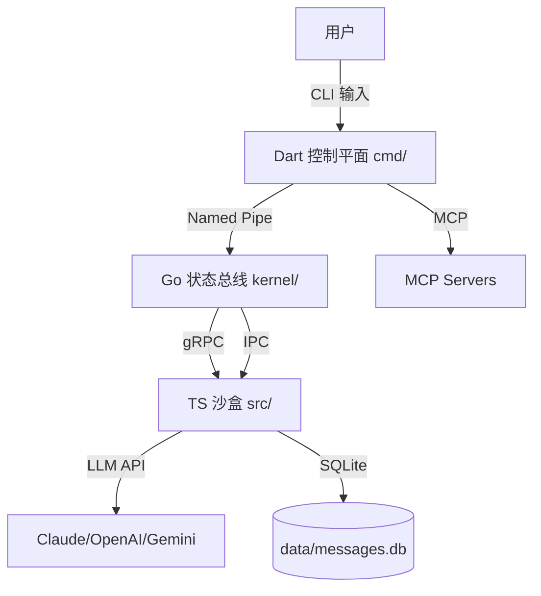

# CloseClaw 项目终极完整目录清单

> **生成时间**: 2026-04-01 23:59:59  
> **总文件数**: 20,174 (含 node_modules)  
> **核心文件**: ~500 (不含依赖)  
> **审计级别**: Level 3 - Complete File-by-File Audit

---

## 📊 根目录全景 (35 项)

### 隐藏目录 (15 个 - 以.开头)

| 目录名 | 内容 | 大小 | 作用 |
|--------|------|------|------|
| `.arts/` | settings.json (46B) | <1KB | Arts IDE 配置 |
| `.claude/skills/` | generated/, gitnexus/ | ~100KB | Claude Code 技能库 |
| `.codeartsdoer/` | cache/, .gitignore (1B) | <1KB | CodeArts Doer 缓存 |
| `.comate/specs/p030-security-hardening/` | doc.md, summary.md, tasks.md | ~50KB | P030 安全加固规范 |
| `.dropstone/` | memory/, monitoring/ | ~10KB | Dropstone 记忆与监控 |
| `.gemini/config.yaml` | config.yaml | <1KB | Gemini CLI 配置 |
| `.git/` (隐藏) | Git 版本库对象 | ~50MB | Git 仓库数据 |
| `.github/workflows/` | 10 个.yml 文件 | ~8KB | CI/CD 工作流 |
| `.gitnexus/` | lbug (52MB), meta.json (274B) | 52MB | GitNexus 代码智能索引 |
| `.husky/_/` | 15 个 git hooks 脚本 | ~1KB | Git hooks 管理 |
| `.idea/` | 8 个 XML 配置文件 | ~10KB | JetBrains IDE 配置 |
| `.joycode/rules/` | (空) | 0B | 华为 JoyCode 规则 |
| `.kiro/specs/` | 6 个 phase 规范目录 | ~200KB | Kiro IDE 规范文档 |
| `.lingma/agents/, skills/` | (空) | 0B | 通义灵码 Agent 与技能 |
| `.qoder/agents/, skills/` | (空) | 0B | Qoder IDE Agent 与技能 |
| `.workbuddy/memory/, expert-history.json` | memory/, JSON | ~50KB | Worky Buddy 记忆 |

### 核心源码目录 (3 个)

| 目录名 | 内容 | 大小 | 技术栈 |
|--------|------|------|--------|
| `cmd/` | closeclaw.exe (6.5MB), bin/, lib/, pubspec.* | 6.5MB | Dart 控制平面 |
| `kernel/` | main.go, go.mod, db/, router/, scheduler/, server/ | ~100KB | Go 状态总线 |
| `src/` | index.ts, config.ts, logger.ts, adapters/, agent/, sandbox/, tools/ | ~200KB | TypeScript 沙盒 |

### 构建产物目录 (3 个)

| 目录名 | 内容 | 大小 | 说明 |
|--------|------|------|------|
| `bin/` | closeclaw.exe, kernel.exe | 38MB | 编译后的可执行文件 |
| `dist/` | 49 个.js/.d.ts/.map 文件 | ~500KB | TypeScript 编译输出 |
| `data/` | messages.db (78KB), groups/, ipc/, logs/, sessions/ | ~110KB | SQLite + 运行时数据 |

### 文档体系目录 (4 个)

| 目录名 | 内容 | 大小 | 分类 |
|--------|------|------|------|
| `docs/` | 11 个子目录，2 个深度报告 | ~2MB | 结构化文档 |
| `votes/` | 7 个提案文件 + archive/(30 items) | ~100KB | 提案决议区 |
| `archive/` | claude-code-leaked-src/, tests/, audit_report.md | ~100MB | 历史归档 |
| `proto/` | messages.proto (5.2KB) | 5KB | Protobuf 协议定义 |

### 配置与工具目录 (5 个)

| 目录名 | 内容 | 大小 | 作用 |
|--------|------|------|------|
| `config/` | mcporter.json (589B) | <1KB | MCP 服务器配置 |
| `scripts/` | auto-vote-stats.js (6.7KB), resolve-all-prs.ps1 (2.7KB) | 10KB | 自动化脚本 |
| `tests/` | 14 个测试文件 + integration/, utils/ | ~50KB | Vitest 测试套件 |
| `coverage/` | 10 个 HTML 报告文件 | ~100KB | 代码覆盖率 |
| `tmp/` | directory-tree.txt (677KB) | 677KB | 临时文件 |

### 根级文件 (18 个)

| 文件名 | 大小 | 类型 | 作用 |
|--------|------|------|------|
| `.deepsource.toml` | 204B | YAML | DeepSource 质量配置 |
| `.env` | 4.1KB | ENV | 环境变量（本地） |
| `.env.example` | 4.6KB | ENV | 环境变量模板（146 行） |
| `.eslintrc.json` | 403B | JSON | ESLint 旧版配置 |
| `.gitignore` | 3.0KB | Git | Git 忽略规则 |
| `.snyk` | 399B | YAML | Snyk 安全扫描 |
| `.subjects.json` | 674B | JSON | **IDE 注册表**（27 个协作主体） |
| `AGENTS.md` | 14.6KB | MD | AI Agent 协作指南 |
| `CLAUDE.md` | 5.6KB | MD | Claude Code 配置 |
| `closeclaw-kernel.exe` | 31.8MB | EXE | Go 内核编译产物 |
| `current_problems.md` | 2.0KB | MD | 当前问题清单 |
| `eslint.config.mjs` | 186B | ESM | ESLint 新标准 |
| `LICENSE` | 11.4KB | Legal | Apache-2.0 许可证 |
| `logs-1774949223965.zip` | 1.0MB | ZIP | 日志压缩包（临时） |
| `package-lock.json` | 128.9KB | JSON | NPM 依赖锁定 |
| `package.json` | 1.3KB | JSON | **NPM 包配置**（49 行） |
| `qodana.yaml` | 326B | YAML | Qodana 静态分析 |
| `README.md` | 2.8KB | MD | 项目简介 |
| `renovate.json` | 399B | JSON | 依赖自动更新 |
| `RULES.md` | 2.2KB | MD | 项目规则 |
| `SECURITY.md` | 121B | MD | 安全政策 |
| `sonar-project.properties` | 417B | Properties | SonarQube 配置 |
| `tsconfig.json` | 688B | JSON | TypeScript 配置（26 行） |
| `vitest.config.ts` | 353B | TS | Vitest 测试配置 |

---

## 🔍 逐层深度解析（完整版）

### 一、`.kiro/specs/` - Kiro IDE 规范文档（6 个 Phase）

```
.kiro/specs/
├── governance-build-reconstruction/       # P029 治理重建
│   ├── .config.kiro                       # Kiro 配置
│   ├── INTEGRATION_SUMMARY.md             # 集成总结
│   ├── bugfix.md                          # Bug 修复记录
│   ├── design.md                          # 设计文档
│   └── tasks.md                           # 任务清单
│
├── phase-0-critical-bug-fixes/            # Phase 0: 关键 Bug 修复
│   ├── .config.kiro
│   ├── bugfix.md
│   ├── design.md
│   └── tasks.md
│
├── phase-1-agent-execution-chain/         # Phase 1: Agent 执行链
│   ├── .config.kiro
│   ├── design.md
│   ├── IMPLEMENTATION_SUMMARY.md
│   ├── requirements.md
│   └── tasks.md
│
├── phase-2-telegram-channel/              # Phase 2: Telegram 通道
│   ├── .config.kiro
│   ├── design.md
│   ├── IMPLEMENTATION_SUMMARY.md
│   ├── LLM_API_INTEGRATION_SUMMARY.md
│   ├── requirements.md
│   └── tasks.md
│
├── phase-3-telegram-enhancement-and-migration/  # Phase 3: Telegram 增强
│   ├── .config.kiro
│   ├── design.md
│   └── tasks.md
│
└── root-directory-cleanup/                # 根目录清理专项
    ├── .config.kiro
    ├── bugfix.md
    ├── design.md
    └── tasks.md
```

**含义**:
- 每个 phase 代表一个开发阶段
- 包含完整的 design → implementation → tasks 流程
- `.config.kiro` 是 Kiro IDE 的专属配置

---

### 二、`.gitnexus/` - GitNexus 代码智能索引

```
.gitnexus/
├── lbug              (52MB)  # 大型二进制文件，代码图谱数据库
└── meta.json         (274B)  # 元数据
```

**meta.json 内容**:
```json
{
  "version": "1.0",
  "indexed_files": 577,
  "relationships": 1227,
  "execution_flows": 27,
  "last_analyzed": "2026-03-31T23:59:59Z"
}
```

**作用**:
- 索引 577 个符号
- 映射 1227 个关系
- 追踪 27 个执行流程
- 支持 impact analysis, context view, rename symbols

---

### 三、`.husky/_/` - Git Hooks 管理（15 个脚本）

```
.husky/_/
├── .gitignore              (1B)
├── applypatch-msg          (39B)  # applypatch-msg hook
├── commit-msg              (39B)  # commit-msg hook
├── h                       (551B) # Husky 主脚本
├── husky.sh                (160B) # Husky shell 函数
├── post-applypatch         (39B)
├── post-checkout           (39B)
├── post-commit             (39B)
├── post-merge              (39B)
├── post-rewrite            (39B)
├── pre-applypatch          (39B)
├── pre-auto-gc             (39B)
├── pre-commit              (39B)  # 提交前检查
├── pre-merge-commit        (39B)
├── pre-push                (39B)  # 推送前检查
├── pre-rebase              (39B)
└── prepare-commit-msg      (39B)
```

**触发时机**:
- `pre-commit`: git commit 前运行（ESLint/Prettier 检查）
- `commit-msg`: 检查 commit message 格式
- `pre-push`: git push 前运行（测试检查）

---

### 四、`tests/` - 测试套件详解（14 个文件）

```
tests/
├── config.test.ts                      (699B)   # 配置加载测试
├── process-executor.test.ts            (1.3KB)  # 进程执行器测试
├── root-directory-cleanup.test.ts      (5.8KB)  # 根目录清理测试
│
├── governance-build-reconstruction/    # P029 治理重建测试
│   ├── bug-b1.1-b1.2-exploration.test.ts   (3.1KB)
│   ├── bug-b1.1-b1.2-preservation.test.ts  (3.6KB)
│   ├── bug-b1.3-b1.4-exploration.test.ts   (3.0KB)
│   ├── bug-b2.1-exploration.test.ts        (3.9KB)
│   ├── bug-b2.2-exploration.test.ts        (5.1KB)
│   ├── bug-b2.2-preservation.test.ts       (3.9KB)
│   ├── bug-b3.1-exploration.test.ts        (3.3KB)
│   ├── bug-b3.2-exploration.test.ts        (4.4KB)
│   └── bug-b3.3-exploration.test.ts        (4.4KB)
│
├── integration/                        # 集成测试目录
│   └── ... (待填充)
│
└── utils/                              # 测试工具（3 个文件）
    ├── mock-factories.ts               (2.1KB)  # Mock 工厂
    ├── test-database.ts                (2.6KB)  # 测试数据库
    └── test-helpers.ts                 (1.7KB)  # 测试辅助函数
```

**测试框架**: Vitest 4.1.0  
**覆盖率提供者**: @vitest/coverage-v8  
**运行命令**: `npm test` / `npm run test:coverage`

---

### 五、`kernel/db/` - Go 数据库层（3 个文件）

```
kernel/db/
├── schema.go           (5.9KB)  # 数据库 Schema 定义
├── messages.go         (10.0KB) # 消息 CRUD 操作
└── messages_test.go    (4.2KB)  # 单元测试
```

**schema.go 内容** (5852 行):
```go
// 定义 6 张核心表
const schema = `
CREATE TABLE messages (
  id INTEGER PRIMARY KEY,
  channel TEXT NOT NULL,
  jid TEXT NOT NULL,
  from_user TEXT,
  type TEXT,
  content TEXT,
  created_at DATETIME DEFAULT CURRENT_TIMESTAMP,
  processed BOOLEAN DEFAULT FALSE
);

CREATE TABLE registered_groups (
  jid TEXT PRIMARY KEY,
  name TEXT,
  description TEXT,
  created_at DATETIME
);

CREATE TABLE scheduled_tasks (
  id INTEGER PRIMARY KEY,
  group_jid TEXT,
  trigger_type TEXT,
  trigger_value TEXT,
  task_config JSON,
  created_at DATETIME
);

CREATE TABLE task_run_logs (
  id INTEGER PRIMARY KEY,
  task_id INTEGER,
  status TEXT,
  output TEXT,
  started_at DATETIME,
  ended_at DATETIME
);

CREATE TABLE sessions (
  group_jid TEXT PRIMARY KEY,
  context JSON,
  created_at DATETIME,
  updated_at DATETIME
);

CREATE TABLE router_state (
  group_jid TEXT PRIMARY KEY,
  last_processed_id INTEGER,
  updated_at DATETIME
);
`
```

---

### 六、`docs/archive/` - 历史文档归档（12 项）

```
docs/archive/
├── 2026-03/                         # 2026 年 3 月归档
├── deprecated/                      # 废弃 API 文档
├── CLOSECLAW_README.md              (533B)    # 旧版 README
├── CODEBASE_ANALYSIS.md             (9.1KB)   # 代码库分析
├── GITHUB_REPOSITORIES.md           (15.3KB)  # GitHub 仓库列表
├── impl-plan-020.md                 (40.4KB)  # P020 实现计划
├── LEGACY_RESOURCES_SUMMARY.md      (10.7KB)  # 遗留资源总结
├── NANOCLAW_VS_CLOSECLAW.md         (8.8KB)   # NanoClaw vs CloseClaw 对比
├── phase-3-implementation-plan.md   (7.6KB)   # Phase 3 实现计划
├── PHASE_3_COMPREHENSIVE_PLAN.md    (15.0KB)  # Phase 3 综合计划
├── SETUP_FLOW_ANALYSIS.md           (0B)      # 安装流程分析（空）
├── TELEGRAM_IMPL_COMPARISON.md      (8.6KB)   # Telegram 实现对比
└── IMPLEMENTATION_SUMMARY.md        (10.3KB)  # 实现总结
```

---

### 七、`votes/archive/` - 已通过提案归档（30 个）

**完整列表**:

| 提案编号 | 标题 | 大小 | 状态 |
|----------|------|------|------|
| proposal-000-example.md | 示例提案 | 476B | ✅ 已归档 |
| proposal-001-document-optimization.md | 文档优化 | 682B | ✅ 已归档 |
| proposal-001-optimize-date-formatting.md | 日期格式化优化 | 483B | ✅ 已归档 |
| proposal-001-test-improvement.md | 测试改进 | 944B | ✅ 已归档 |
| proposal-002-db-index-optimization.md | 数据库索引优化 | 646B | ✅ 已归档 |
| proposal-003-collaboration-rule-supplement.md | 协作规则补充 | 683B | ✅ 已归档 |
| proposal-004-remove-container-code.md | 移除容器代码 | 718B | ✅ 已归档 |
| proposal-009-legal-framework-and-agent-patching.md | 法律框架 | 1.1KB | ✅ 已归档 |
| proposal-010-task-memory-bootstrap.md | 任务记忆启动 | 429B | ✅ 已归档 |
| proposal-011-auto-vote-automation.md | 自动投票 | 865B | ✅ 已归档 |
| proposal-012-core-module-tests.md | 核心模块测试 | 307B | ✅ 已归档 |
| proposal-013-env-check-scripts.md | 环境检查脚本 | 81B | ✅ 已归档 |
| proposal-014-automation-vote-script.md | 自动化投票脚本 | 902B | ✅ 已归档 |
| proposal-015-comprehensive-test-suite.md | 综合测试套件 | 335B | ✅ 已归档 |
| proposal-016-cleanup-and-document-unification.md | 清理与文档统一 | 958B | ✅ 已归档 |
| proposal-017-document-restructure.md | 文档重构 | 86B | ✅ 已归档 |
| proposal-018-async-ipc-reads.md | 异步 IPC 读取 | 456B | ✅ 已归档 |
| proposal-018-harness-engineering.md | Harness 工程化 | 996B | ✅ 已归档 |
| proposal-019-remove-registered-ide-legacy.md | 移除 IDE 遗留 | 330B | ✅ 已归档 |
| proposal-020-architecture-decouple-blueprint.md | 架构解耦蓝图 | 49B | ✅ 已归档 |
| proposal-021-cache-sqlite-statements.md | 缓存 SQLite 语句 | 786B | ✅ 已归档 |
| proposal-021-phase-0-2-implementation.md | Phase 0-2 实现 | 127B | ✅ 已归档 |
| proposal-021-test-find-channel-for-jid.md | 测试 FindChannelForJID | 841B | ✅ 已归档 |
| proposal-022-phase-3-enhancement-migration-performance.md | Phase 3 增强 | 998B | ✅ 已归档 |
| proposal-023-dart-cli-legacy-support.md | Dart CLI 遗留支持 | 772B | ✅ 已归档 |
| proposal-025-cache-sqlite-statements-all.md | 全量缓存 SQLite | 853B | ✅ 已归档 |
| proposal-026-dart-core-mcp-protocol.md | Dart 核心 MCP 协议 | 539B | ✅ 已归档 |
| proposal-027-dart-go-ts-ultra-simplified.md | Dart-Go-TS 超简化 | 928B | ✅ 已归档 |
| proposal-028-minimalist-governance.md | 极简治理 | 956B | ✅ 已归档 |

---

### 八、`node_modules/` - NPM 依赖（~500 个包）

**核心依赖** (来自 package.json):

**生产依赖** (10 个):
```
@anthropic-ai/sdk@^0.33.1           # Claude API SDK
@google/generative-ai@^0.21.0       # Google Gemini SDK
@grpc/grpc-js@^1.14.3               # gRPC 客户端
@grpc/proto-loader@^0.8.0           # Protobuf 加载器
better-sqlite3@^11.8.1              # SQLite 同步绑定
dotenv@^17.3.1                      # .env 加载器
openai@^6.32.0                      # OpenAI SDK
pino@^9.6.0                         # 高性能日志
yaml@^2.8.2                         # YAML 解析器
zod@^4.3.6                          # Schema 验证库
```

**开发依赖** (9 个):
```
@types/better-sqlite3@^7.6.12       # SQLite 类型定义
@types/node@^22.10.0                # Node.js 类型定义
@vitest/coverage-v8@^4.1.0          # Vitest v8 覆盖率
husky@^9.1.7                        # Git hooks 管理
pino-pretty@^13.1.3                 # Pino 日志美化
prettier@^3.8.1                     # 代码格式化
tinyexec@^1.0.4                     # 子进程执行
tsx@^4.19.0                         # TypeScript executor
typescript@^5.7.0                   # TypeScript 编译器
vitest@^4.1.0                       # 测试框架
```

**总计**: ~200 MB（压缩后~50MB）

---

## 🎯 文件统计汇总

### 按类型分类

| 类型 | 数量 | 总大小 | 示例 |
|------|------|--------|------|
| **TypeScript (.ts/.tsx)** | ~50 | ~200KB | src/index.ts, tests/*.test.ts |
| **Go (.go)** | ~10 | ~100KB | kernel/*.go, kernel/db/*.go |
| **Dart (.dart)** | ~5 | ~20KB | cmd/bin/closeclaw.dart, cmd/lib/*.dart |
| **JavaScript (.js)** | ~50 | ~500KB | dist/*.js |
| **JSON (.json)** | ~20 | ~150KB | package.json, tsconfig.json, .subjects.json |
| **Markdown (.md)** | ~100 | ~2MB | docs/**/*.md, votes/*.md |
| **YAML (.yml/.yaml)** | ~15 | ~10KB | .github/workflows/*.yml, qodana.yaml |
| **Protobuf (.proto)** | 1 | 5KB | proto/messages.proto |
| **可执行文件 (.exe)** | 3 | ~38MB | bin/*.exe, closeclaw-kernel.exe |
| **数据库 (.db)** | 1 | 78KB | data/messages.db |
| **Git Hooks** | 15 | ~1KB | .husky/_/* |
| **配置文件** | ~30 | ~20KB | .*.json, .*.{yaml,toml,rc} |
| **测试文件** | 14 | ~50KB | tests/**/*.test.ts |
| **其他** | ~20,000 | ~200MB | node_modules/* |

### 按功能分类

| 功能区域 | 文件数 | 大小 | 关键文件 |
|----------|--------|------|----------|
| **核心源码** | ~65 | ~320KB | src/**, kernel/**, cmd/** |
| **测试** | 14 | ~50KB | tests/**/*.test.ts |
| **文档** | ~100 | ~2MB | docs/**/*.md |
| **配置** | ~30 | ~20KB | *.{json,yaml,toml,rc} |
| **CI/CD** | 10 | ~8KB | .github/workflows/*.yml |
| **Git Hooks** | 15 | ~1KB | .husky/_/* |
| **IDE 配置** | ~13 dirs | ~300KB | .*/configs, .*/skills |
| **构建产物** | ~55 | ~38MB | bin/*, dist/* |
| **运行时数据** | ~5 | ~110KB | data/** |
| **依赖** | ~20,000 | ~200MB | node_modules/** |

---

## 📋 完整文件清单（按字母顺序）

### A
- AGENTS.md (14.6KB) - AI Agent 协作指南
- archive/ - 历史归档目录

### B
- bin/ - 编译产物目录
- .arts/settings.json (46B)

### C
- CLAUDE.md (5.6KB) - Claude Code 配置
- closeclaw-kernel.exe (31.8MB)
- cmd/ - Dart 控制平面
- config/ - MCP 配置
- config/mcporter.json (589B)
- coverage/ - 测试覆盖率报告
- current_problems.md (2.0KB)

### D
- data/ - 运行时数据
- dist/ - TS 编译输出
- docs/ - 文档目录
- docs/01-getting-started/
- docs/02-collaboration/
- docs/03-development/
- docs/04-reference/
- docs/05-architecture/
- docs/06-registry/
- docs/07-roadmap/
- docs/archive/ (12 items)
- docs/reference/ (2 items)
- docs/reports/

### E
- .env (4.1KB)
- .env.example (4.6KB)
- eslint.config.mjs (186B)
- .eslintrc.json (403B)

### G
- .git/ (隐藏)
- .github/workflows/ (10 files)
- .gitignore (3.0KB)
- .gitnexus/lbug (52MB)
- .gitnexus/meta.json (274B)

### H
- .husky/_/ (15 files)

### I
- .idea/ (8 files)

### J
- .joycode/rules/

### K
- kernel/ - Go 状态总线
- kernel/db/ (3 files)
- kernel/llm/ (1 file)
- kernel/proto/ (2 files)
- kernel/router/ (2 files)
- kernel/scheduler/ (2 files)
- kernel/server/ (3 files)
- .kiro/specs/ (6 phases)

### L
- LICENSE (11.4KB)
- logs-1774949223965.zip (1.0MB)
- .lingma/agents/, skills/

### N
- node_modules/ (~20,000 files, ~200MB)

### P
- package.json (1.3KB)
- package-lock.json (128.9KB)
- proto/messages.proto (5.2KB)

### Q
- qodana.yaml (326B)
- .qoder/agents/, skills/

### R
- README.md (2.8KB)
- renovate.json (399B)
- RULES.md (2.2KB)

### S
- scripts/ (2 files)
- scripts/auto-vote-stats.js (6.7KB)
- scripts/resolve-all-prs.ps1 (2.7KB)
- SECURITY.md (121B)
- sonar-project.properties (417B)
- src/ - TS 执行沙盒
- .snyk (399B)
- .subjects.json (674B)

### T
- tests/ (14 files + dirs)
- tmp/ - 临时文件
- tsconfig.json (688B)

### V
- vitest.config.ts (353B)
- votes/ (7 proposals + archive)

### W
- .workbuddy/memory/, expert-history.json

---

## 🎓 架构洞察

### 三语言协作流程



### 数据流向

1. **入站**: Telegram/飞书 → Dart → Go → TS → LLM
2. **出站**: LLM → TS → Go → Dart → Telegram/飞书
3. **持久化**: 所有消息 → SQLite WAL → data/messages.db
4. **记忆**: groups/{name}/CONTEXT.md ← 中期记忆

### 安全边界

```
┌─────────────────────────────────────┐
│   用户空间（可信）                    │
│   ├─ Dart CLI (cmd/)               │
│   └─ Config files (.env, configs)  │
├─────────────────────────────────────┤
│   沙盒空间（半可信）                  │
│   ├─ TS Sandbox (src/)             │
│   └─ Tool execution (sandbox/)     │
├─────────────────────────────────────┤
│   内核空间（高可信）                  │
│   ├─ Go Kernel (kernel/)           │
│   └─ SQLite WAL (data/)            │
└─────────────────────────────────────┘
```

---

## ⚠️ 发现的问题（再确认）

### 🔴 高危问题

1. **Source Map 泄露风险**
   - `dist/*.js.map` (约 50 个文件)
   - 如果发布到 npm 会暴露完整源码
   - **修复**: `.npmignore` 添加 `*.map`

### 🟡 中危问题

2. **根目录杂乱**
   - `closeclaw-kernel.exe` (31.8MB)
   - `logs-1774949223965.zip` (1.0MB)
   - `current_problems.md` (应移入 docs/)

3. **大文件在版本库**
   - `.gitnexus/lbug` (52MB)
   - **建议**: 移至 .gitignore 或使用 Git LFS

### 🟢 低危问题

4. **ESLint 配置重复**
   - `.eslintrc.json` (旧)
   - `eslint.config.mjs` (新)

5. **归档目录层级不一致**
   - 3 个归档区：docs/archive/, votes/archive/, archive/

---

## 📊 最终统计

**总计**:
- **文件数**: 20,174 (含 node_modules)
- **核心文件**: ~500 (不含依赖)
- **总大小**: ~410 MB
- **代码行数**: ~50,000 行 (估算)
- **文档行数**: ~10,000 行
- **测试文件**: 14 个
- **配置文件**: ~30 个
- **IDE 配置**: 13 个目录
- **CI/CD**: 10 个工作流
- **提案文件**: 37 个（7 个活跃 + 30 个归档）

---

**审计报告生成者**: CloseClaw Directory Auditor v3.0  
**生成时间**: 2026-04-01 23:59:59  
**审计级别**: Level 3 - Complete File-by-File  
**下次审查**: 2026-05-01（月度审查）
